# ChatGPT-Prompt-Engineering-For-Developers

## 项目简介

看了 Andrew Ng(吴恩达) x Isa Fulford《ChatGPT Prompt Engineering for Developers》课程以后受益匪浅，做了图文教程版方便自己回顾。如果能够帮到你是最好不过了。因为是个人总结的，信息不如原视频详细，想体验一手资料的朋友可移步下列链接

英文原版视频：[ChatGPT Prompt Engineering For Developers](https://learn.deeplearning.ai/chatgpt-prompt-eng/lesson/1/introduction) 

中文字幕视频地址：[吴恩达 x OpenAI 的 Prompt Engineering 课程专业翻译版](https://www.bilibili.com/video/BV1Bo4y1A7FU/?share_source=copy_web) 

中英双语字幕下载：[《ChatGPT 提示工程》非官方版中英双语字幕](https://github.com/GitHubDaily/ChatGPT-Prompt-Engineering-for-Developers-in-Chinese)

也可以期待一波大佬们整理的课程

[ChatGPT Prompt Engineering For Developers 课程中文版 Datawahale](https://github.com/datawhalechina/prompt-engineering-for-developers)

## 内容大纲
- [课程简介](#课程简介)
  - [基础大语言模型（Base LLM）](#基础大语言模型base-llm)
  - [指令学习大语言模型（Instruction Tuned LLM）](#指令学习大语言模型instruction-tuned-llm)
  - [简短举例说明如何使用 Instruction Tuned LLM](#简短举例说明如何使用-instruction-tuned-llm)
- [提示指南](#提示指南)
  - [原则一：写出清晰而具体的提示](#原则一写出清晰而具体的提示)
    - [策略一：使用分界符来指出不同输入的不同部分。](#策略一使用分界符来指出不同输入的不同部分)
    - [策略二：要求格式化输出，格式类似HTML，JSON](#策略二要求格式化输出格式类似htmljson)
    - [策略三： 要求模型检查条件是否得到满足。](#策略三-要求模型检查条件是否得到满足)
    - [策略四："Few-shot" prompting](#策略四few-shot-prompting)
  - [原则二：给模型思考的时间](#原则二给模型思考的时间)
    - [策略一：指定完成任务的步骤](#策略一指定完成任务的步骤)
    - [策略二：在急于得出结论之前，引导模型自行解决问题](#策略二在急于得出结论之前引导模型自行解决问题)
  - [模型的局限性](#模型的局限性)
- [迭代开发你的提示词](#迭代开发你的提示词)
  - [提示词迭代过程](#提示词迭代过程)
  - [椅子说明书的例子](#椅子说明书的例子)
    - [迭代一：生成的文本太长，可以限制单词/句子/字符的数量](#迭代一生成的文本太长可以限制单词句子字符的数量)
    - [迭代二：当生成的文本关注了错误的细节时，提示词说明应该侧重于哪些方面](#迭代二当生成的文本关注了错误的细节时提示词说明应该侧重于哪些方面)
    - [迭代三：需要尺寸以表格形式描述](#迭代三需要尺寸以表格形式描述)
- [文本总结](#文本总结)
  - [在单词数/句子数/字符数限制的条件下总结](#在单词数句子数字符数限制的条件下总结)
  - [对不同的主题进行总结](#对不同的主题进行总结)
    - [主题为运输和交付时](#主题为运输和交付时)
    - [主题为价格和价值时](#主题为价格和价值时)
    - [尝试用「提取」来替代「总结」](#尝试用提取来替代总结)
  - [总结多个产品评论](#总结多个产品评论)
- [模型推断](#模型推断)
  - [情感判断](#情感判断)
    - [情感类型判断](#情感类型判断)
    - [判断是否包含愤怒情绪](#判断是否包含愤怒情绪)
    - [从消费者评论中提取产品名和公司名](#从消费者评论中提取产品名和公司名)
    - [一次完成多项任务(情感情绪判断、文本提取)](#一次完成多项任务情感情绪判断文本提取)
  - [主题推断](#主题推断)
    - [推断出五个主题标签](#推断出五个主题标签)
    - [为特定的主题设置提醒](#为特定的主题设置提醒)
- [文本转换](#文本转换)
  - [语言翻译](#语言翻译)
    - [单句翻译](#单句翻译)
    - [识别语言](#识别语言)
    - [多种语言同时翻译](#多种语言同时翻译)
    - [建立通用翻译器](#建立通用翻译器)
  - [文本语气调整](#文本语气调整)
  - [文本格式转换](#文本格式转换)
  - [语言拼写和检查](#语言拼写和检查)
    - [使用 Python 包 Redlines 可以查看文本经过模型修改后的前后差异](#使用-python-包-redlines-可以查看文本经过模型修改后的前后差异)
    - [要求修改后的文本按照特定的风格和格式输出](#要求修改后的文本按照特定的风格和格式输出)
- [文本扩写](#文本扩写)
- [聊天机器人](#聊天机器人)
- [课程总结](#课程总结)


## 课程简介
本节介绍了两种 大语言模型（Large Language models）并解释了它们的不同之处。
### 基础大语言模型（Base LLM）
Base LLM 被训练成基于文本训练数据来预测下一个单词，通过互联网和其它来源的大量文本数据计算出下一个最可能出现的词是什么。

```
比如你输入提示：
从前有只独角兽，它会进行补全，并预测接下来的几个词是
和所有独角兽朋友一起生活在一个神奇的森林里

如果你是用"法国的首都是什么"作为提示语，Base LLM 可能会输出以下内容。
什么是法国最大的城市？
什么是法国的人口？
因为互联网上的文章很可能是关于法国的测验问题列表。
```

### 指令学习大语言模型（Instruction Tuned LLM）
Instruction Tuned LLM 的训练方式是从一个在大量文本数据上训练过的 Base LLM 开始，然后进一步训练它，并通过输入和输出来微调其性能以遵循指示并尝试执行好这些指示。然后通常使用一种叫做人类反馈强化学习（Reinforcement Learning with Human Feedback）技术进一步优化系统，使其更能够帮助人们并遵循指示。
```
比如你输入提示：
法国首都是什么？
它很有可能输出法国的首都是巴黎
```
Instruction Tuned LLM 经过训练后与 Base LLM 相比在输出内容的安全方面有很大的提升，并且由于 OpenAI 和其他 LLMs 公司的工作，Instruction Tuned LLM 将会变得更加安全和一致。所以吴恩达老师建议大多人们关注学习 Instruction Tuned LLM.
### 简短举例说明如何使用 Instruction Tuned LLM 
当你使用 Instruction Tuned LLMs 时，可以比作向另一个聪明但不知道任务具体细节的人发出指令。所以 LLMs 无法工作时，有时是因为说明不够清晰。
例如，如果你想说“请写一些关于艾伦·图灵的东西”，除此之外，还可以明确是否希望文本集中讨论他的科学工作、个人生活或历史角色等方面。并且如果你指定了文本应该采取何种语气，则更有助于实现期望效果，它应该像专业记者写作那样正式吗，还是更像给朋友随手写下的小纸条？
当然，如果你想象自己在要求一位刚毕业的大学生为你完成这项任务，甚至可以指定他们事先需要阅读哪些文本片段来撰写关于艾伦·图灵的文章，这能帮助大学生更好地完成任务。
## 提示指南
### 原则一：写出清晰而具体的提示
#### 策略一：使用分界符来指出不同输入的不同部分
以下符号都是可以的，任选其一，自己喜欢就好
* 三个引号："""
* 三个反引号： ```
* 三个波折号：---
* 尖括号： <>
* XML 标签：<tag></tag>
```
Text：
You should express what you want a model to do by providing instructions that are as clear and specific as you can 
possibly make them. This will guide the model towards the desired output,  and reduce the chances of receiving 
irrelevant or incorrect responses. Don't confuse writing a clear prompt with writing a short prompt. In many cases, 
longer prompts provide more clarity and context for the model, which can lead to more detailed and relevant outputs.

Prompt：
Summarize the text delimited by triple backticks into a single sentence.
```{text}```
```
使用分隔符可以避免提示词的注入，如果总结的内容是指令的话，那么分隔符可以很好地区分开来，例如

图片中使用了 ''' 分隔符，模型就知道要总结内容，而不是遵循内容中的指令
#### 策略二：要求格式化输出，格式类似HTML，JSON
```
Prompt:
Generate a list of three made-up book titles along with their authors and genres. 
Provide them in JSON format with the following keys: book_id, title, author, genre.
```

#### 策略三： 要求模型检查条件是否得到满足
如果任务中的条件并不一定满足，我们可以告诉模型先检查条件，条件如不满足，则指出条件不满足的地方并停止执行任务。也可以实现考虑好任务的边界条件，告诉模型如何处理。
例如 从一段泡茶步骤中提取指令（有指令步骤的例子）
```
Text:
Making a cup of tea is easy! First, you need to get some water boiling. While that's happening, grab a cup and put 
a tea bag in it. Once the water is hot enough, just pour it over the tea bag.  Let it sit for a bit so the tea can 
steep. After a few minutes, take out the tea bag. If you like, you can add some sugar or milk to taste.  And 
that's it! You've got yourself a delicious cup of tea to enjoy.

Prompt：
You will be provided with text delimited by triple quotes. 
If it contains a sequence of instructions, re-write those instructions in the following format:
Step 1 - ...
Step 2 - …
…
Step N - …
If the text does not contain a sequence of instructions, then simply write No steps provided.
```

无指令步骤的例子，下面一段描写场景的文本。
```
Text:
The sun is shining brightly today, and the birds are singing. It's a beautiful day to go for a walk in the park.
The flowers are blooming, and the  trees are swaying gently in the breeze. Peopleare out and about, enjoying the 
lovely weather.  Some are having picnics, while others are playing  games or simply relaxing on the grass. It's 
a perfect day to spend time outdoors and appreciate the  beauty of nature.

Prompt:
You will be provided with text delimited by triple quotes. 
If it contains a sequence of instructions, re-write those instructions in the following format:

Step 1 - ...
Step 2 - …
…
Step N - …
If the text does not contain a sequence of instructions, then simply write No steps provided.
```

#### 策略四："Few-shot" prompting
我把它理解为样本学习，我们给出模板，模型参照学习
```
Prompt:
Your task is to answer in a consistent style.
<child>: Teach me about patience.
<grandparent>: The river that carves the deepest valley flows from a modest spring; the 
grandest symphony originates from a single note; the most intricate tapestry begins with a solitary thread.

<child>: Teach me about resilience.
```

通过以上四个策略，可以确保我们距离「写出清晰而具体的提示」这一原则不会偏差的太远。
### 原则二：给模型思考的时间
要保持这一原则的原因视频中有解释，主要有两点，我的理解如下:</br>
第一点是如果指定的任务太复杂，模型无法在短时间内或用少量的词语完成它，它可能会编造一个猜测答案，这个猜测答案可能是错误的。</br>
基于第一点，第二点是模型在推理时出现了错误，用时少但是得出了错误的结论。我们应该重新设计提示语，要求模型有一系列的推理，然后再提供最终的答案。</br>
「而我们重新设计提示语，要求模型有自己的推理」的过程，就是原则二「给模型思考的时间」</br>
这一章也介绍两个策略来告诉我们如何保持这一原则。
#### 策略一：指定完成任务的步骤
```
Prompts:
Perform the following actions: 
1 - Summarize the following text delimited by triple backticks with 1 sentence.
2 - Translate the summary into French.
3 - List each name in the French summary.
4 - Output a json object that contains the following 
keys: french_summary, num_names.
Separate your answers with line breaks.

Text:
'''
In a charming village, siblings Jack and Jill set out on a quest to fetch water from a hilltop well. As they climbed，
singing joyfully, misfortune struck—Jack tripped on a stone and tumbled down the hill, with Jill following suit. 
Though slightly battered, the pair returned home to comforting embraces. Despite the mishap, their adventurous 
spirits remained undimmed, and they continued exploring with delight.
'''
```

要求输出特殊格式
```
Your task is to perform the following actions: 
1 - Summarize the following text delimited by triple backticks with 1 sentence.
2 - Translate the summary into French.
3 - List each name in the French summary.
4 - Output a json object that contains the following keys: french_summary, num_names.

Use the following format:
Text: <text to summarize>
Summary: <summary>
Translation: <summary translation>
Names: <list of names in Italian summary>
Output JSON: <json with summary and num_names>

Text: 
'''
In a charming village, siblings Jack and Jill set out on a quest to fetch water from a hilltop well. As they climbed, 
singing joyfully, misfortune struck—Jack tripped on a stone and tumbled down the hill, with Jill following suit. 
Though slightly battered, the pair returned home to comforting embraces. Despite the mishap, their adventurous 
spirits remained undimmed, and they continued exploring with delight.
'''
```

#### 策略二：在急于得出结论之前，引导模型自行解决问题
下面是一个「判断学生方案是否正确」的例子
```
Prompt:
Determine if the student's solution is correct or not.

Question:
I'm building a solar power installation and I need help working out the financials. 
- Land costs $100 square foot
- I can buy solar panels for $250 square foot
- I negotiated a contract for maintenance that will cost me a flat $100k per year, and an additional $10 
square foot.
What is the total cost for the first year of operations as a function of the number of square feet.

Student's Solution:
Let x be the size of the installation in square feet.
Costs:
1. Land cost: 100x
2. Solar panel cost: 250x
3. Maintenance cost: 100,000 + 100x
Total cost: 100x + 250x + 100,000 + 100x = 450x + 100,000
```

请注意其实学生的做法是错误的，而 ChatGPT 却认为学生的做法是对的,我们可以通过指导模型首先得出它自己的解决方案来修复此缺陷。
```
Prompt:
Your task is to determine if the student's solution is correct or not.
To solve the problem do the following:
- First, work out your own solution to the problem. 
- Then compare your solution to the student's solution and evaluate if the student's solution is correct or not. 
Don't decide if the student's solution is correct until you have done the problem yourself.

Use the following format:
Question:
‘’‘
question here
‘’‘
Student's solution:
‘’‘
student's solution here
‘’‘
Actual solution:
‘’‘
steps to work out the solution and your solution here
‘’‘
Is the student's solution the same as actual solution just calculated:
‘’‘
yes or no
‘’‘
Student grade:
‘’‘
correct or incorrect
‘’‘

Question:
‘’‘
I'm building a solar power installation and I need help working out the financials. 
- Land costs $100 square foot
- I can buy solar panels for $250 square foot
- I negotiated a contract for maintenance that will cost me a flat $100k per year, and an additional 
$10 square foot.
What is the total cost for the first year of operations as a function of the number of square feet.

Student's Solution:
Let x be the size of the installation in square feet.
Costs:
1. Land cost: 100x
2. Solar panel cost: 250x
3. Maintenance cost: 100,000 + 100x
Total cost: 100x + 250x + 100,000 + 100x = 450x + 100,000
‘’‘
```
下图是我用 GPT-4 得出的答案，用 GPT-3.5 暂时无法得出答案，有哪位朋友用 GPT-3.5 得出正确答案了。请不吝赐教你的 Prompt

### 模型的局限性
视频中还介绍了一个模型的局限性。我理解为模型会虚构事物，虚构的非常真实，但其实不是真的。那如何减少模型虚构的可能性呢？做法是如果是基于文本生成答案，则要求模型在文中找到任何相关的引用，使用引用来回答问题。
视频课程中列举了一个智能牙刷的例子来证明 GPT 模型的虚构能力，在现实生活不存在这款智能牙刷的。
以下是 GPT-3.5 和 GPT-4 的回答


## 迭代开发你的提示词
吴恩达老师讲没有任何一个提示词可以完美地适应每个场景，不必太多关注网上“xx个提示词更好地帮助你”类似这样的文章，获得合适的提示词的过程才是重要的。
### 提示词迭代过程
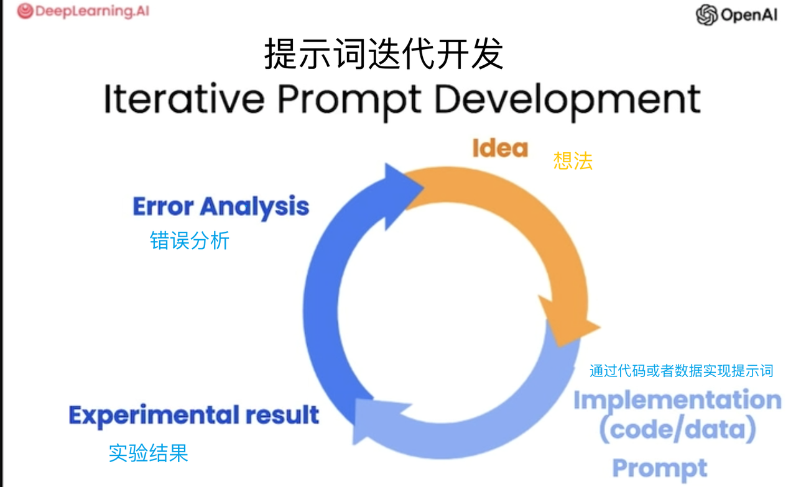
- 提示词清晰简洁
- 分析为什么没有得到期望的输出
- 完善想法和提示，或者给模型更多的时间思考
- 重复以上过程
### 椅子说明书的例子
```
Prompt:
Your task is to help a marketing team create a description for a retail website of a product based on a technical 
fact sheet.

Write a product description based on the information provided in the technical specifications delimited by triple 
backticks.

Technical specifications:
'''
OVERVIEW
- Part of a beautiful family of mid-century inspired office furniture, including filing cabinets, desks, 
bookcases, meeting tables, and more.
- Several options of shell color and base finishes.
- Available with plastic back and front upholstery (SWC-100) or full upholstery (SWC-110) in 10 fabric 
and 6 leather options.
- Base finish options are: stainless steel, matte black, gloss white, or chrome.
- Chair is available with or without armrests.
- Suitable for home or business settings.
- Qualified for contract use.

CONSTRUCTION
- 5-wheel plastic coated aluminum base.
- Pneumatic chair adjust for easy raise/lower action.

DIMENSIONS
- WIDTH 53 CM | 20.87”
- DEPTH 51 CM | 20.08”
- HEIGHT 80 CM | 31.50”
- SEAT HEIGHT 44 CM | 17.32”
- SEAT DEPTH 41 CM | 16.14”

OPTIONS
- Soft or hard-floor caster options.
- Two choices of seat foam densities: 
 medium (1.8 lb/ft3) or high (2.8 lb/ft3)
- Armless or 8 position PU armrests 

MATERIALS
SHELL BASE GLIDER
- Cast Aluminum with modified nylon PA6/PA66 coating.
- Shell thickness: 10 mm.
SEAT
- HD36 foam

COUNTRY OF ORIGIN
- Italy
```
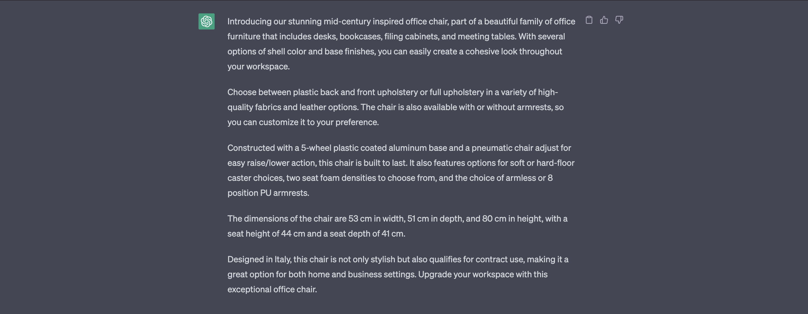
#### 迭代一：生成的文本太长，可以限制单词/句子/字符的数量
```
Your task is to help a marketing team create a description for a retail website of a product based on a technical 
fact sheet.

Write a product description based on the information provided in the technical specifications delimited by 
triple backticks.

Use at most 50 words.
Use at most 3 sentences
Use at most 280 characters

Technical specifications:
'''
chair description
'''
```

#### 迭代二：当生成的文本关注了错误的细节时，提示词说明应该侧重于哪些方面
下面是一个「面向家具零售商，侧重于椅子的技术和材料性质的产品描述」
```
Prompt:
Your task is to help a marketing team create a description for a retail website of a product based on a technical 
fact sheet.

Write a product description based on the information provided in the technical specifications delimited by 
triple backticks.

The description is intended for furniture retailers, so should be technical in nature and focus on the 
materials the product is constructed from.
At the end of the description, include every 7-character Product ID in the technical specification.

Use at most 50 words.

Technical specifications:
'''
chair description
'''
```

#### 迭代三：需要尺寸以表格形式描述
```
Prompt:
Your task is to help a marketing team create a description for a retail website of a product based on a technical 
fact sheet.

Write a product description based on the information provided in the technical specifications delimited by 
triple backticks.

The description is intended for furniture retailers, so should be technical in nature and focus on the 
materials the product is constructed from.
At the end of the description, include every 7-character Product ID in the technical specification.

Use at most 50 words.

After the description, include a table that gives the product's dimensions. The table should have two columns.
In the first column include the name of the dimension. In the second column include the measurements in inches only.

Give the table the title 'Product Dimensions'.

Format everything as HTML that can be used in a website. 
Place the description in a <div> element.

Technical specifications:
'''
chair description
'''
```
```HTML
ChatGPT:
<div>
  Discover this mid-century inspired office chair, crafted from cast aluminum with a modified nylon PA6/PA66 coating. 
  Featuring a 5-wheel base, pneumatic adjust, and HD36 foam seat, choose from plastic (SWC-100) or fully 
  upholstered (SWC-110) options. Armrests optional. Ideal for contract use.
</div>

<table>
  <caption>Product Dimensions</caption>
  <tr>
    <th>Dimension</th>
    <th>Measurement (in)</th>
  </tr>
  <tr>
    <td>Width</td>
    <td>20.87</td>
  </tr>
  <tr>
    <td>Depth</td>
    <td>20.08</td>
  </tr>
  <tr>
    <td>Height</td>
    <td>31.50</td>
  </tr>
  <tr>
    <td>Seat Height</td>
    <td>17.32</td>
  </tr>
  <tr>
    <td>Seat Depth</td>
    <td>16.14</td>
  </tr>
</table>

```
## 文本总结
这节课程主要向我们展现了 ChatGPT 的文本总结能力，我们以下列商品评论为文本来看看 ChatGPT 可以怎样去总结文本。
```
Text：
Got this panda plush toy for my daughter's birthday, who loves it and takes it everywhere. It's soft and super 
cute, and its face has a friendly look. It's a bit small for what I paid though. I think there might be other 
options that are bigger for the same price. It arrived a day earlier than expected, so I got to play with it 
myself before I gave it to her.
```
### 在单词数/句子数/字符数限制的条件下总结
```
Prompt:
Your task is to generate a short summary of a product review from an ecommerce site. 
Summarize the review below, delimited by triple backticks, in at most 30 words/in at most three words/in at 
most 280 characters. 

Review:
'''
revies description
'''

ChatGPT:
Soft and super cute panda plush toy loved by daughter and arrived a day earlier. However, a bit small 
for the price.
```
### 对不同的主题进行总结
#### 主题为运输和交付时
```
Prompt：
Your task is to generate a short summary of a product review from an ecommerce site to give feedback to 
the Shipping deparmtment. 

Summarize the review below, delimited by triple backticks, in at most 30 words, and focusing on any 
aspects that mention shipping and delivery of the product. 

Review:
'''
revies description
'''

ChatGPT:
The product arrived a day earlier than expected, allowing for personal testing, but the customer feels 
it's overpriced for the small size. No specific feedback for the shipping department.
```
#### 主题为价格和价值时
```
Prompt:
Your task is to generate a short summary of a product review from an ecommerce site to give feedback 
to the pricing deparmtment, 
responsible for determining the price of the product.  

Summarize the review below, delimited by triple backticks, in at most 30 words, and focusing on any 
aspects that are relevant to the price and perceived value. 

Review:
'''
revies description
'''

ChatGPT:
The plush toy is soft, cute, and loved by the recipient, but a bit small for the price paid. The 
reviewer suggests there may be better options at the same price point.
```
#### 尝试用「提取」来替代「总结」
「总结」会包含与焦点话题无关的话题，「提取」只输出焦点话题的内容。
```
Prompt:
Your task is to extract relevant information from a product review from an ecommerce site to give 
feedback to the Shipping department. 
From the review below, delimited by triple quotes extract the information relevant to shipping and 
delivery. Limit to 30 words. 

Review:
'''
revies description
'''

ChatGPT:
Arrived a day earlier than expected.
```
### 总结多个产品评论
```
Text1:
Needed a nice lamp for my bedroom, and this one had additional storage and not too high of a price point. 
Got it fast - arrived in 2 days. The string to the lamp broke during the transit and the company happily 
sent over a new one. Came within a few days as well. It was easy to put together. Then I had a missing 
part, so I contacted their support and they very quickly got me the missing piece! Seems to me to be a 
great company that cares about their customers and products. 
```
```
Text2:
My dental hygienist recommended an electric toothbrush, which is why I got this. The battery life seems 
to be pretty impressive so far. After initial charging and leaving the charger plugged in for the first 
week to condition the battery, I've unplugged the charger and been using it for twice daily brushing for 
the last 3 weeks all on the same charge. But the toothbrush head is too small. I’ve seen baby toothbrushes 
bigger than this one. I wish the head was bigger with different length bristles to get between teeth better 
because this one doesn’t.  Overall if you can get this one around the $50 mark, it's a good deal. The 
manufactuer's replacements heads are pretty expensive, but you can get generic ones that're more reasonably 
priced. This toothbrush makes me feel like I've been to the dentist every day. My teeth feel sparkly clean! 
```
```
Text3:
So, they still had the 17 piece system on seasonal sale for around $49 in the month of November, about half 
off, but for some reason (call it price gouging) around the second week of December the prices all went up 
to about anywhere from between $70-$89 for the same system. And the 11 piece system went up around $10 or so 
in price also from the earlier sale price of $29. So it looks okay, but if you look at the base, the part where 
the blade locks into place doesn’t look as good as in previouseditions from a few years ago, but I plan to be 
very gentle with it (example, I crush very hard items like beans, ice, rice, etc. in the blender first then 
pulverize them in the serving size I want in the blender then switch to the whipping blade for a finer flour, 
and use the cross cutting blade first when making smoothies, then use the flat blade if I need them finer/less 
pulpy). Special tip when making smoothies, finely cut and freeze the fruits and vegetables (if using spinach-lightly 
stew soften the spinach then freeze until ready for use-and if making sorbet, use a small to medium sized food 
processor) that you plan to use that way you can avoid adding so much ice if at all-when making your smoothie.
After about a year, the motor was making a funny noise.I called customer service but the warranty expired already, 
so I had to buy another one. FYI: The overall quality has gone done in these types of products, so they are kind 
of counting on brand recognition and consumer loyalty to maintain sales. Got it in about two days.
```
```
Prompt:
因为视频中用了 Python 中的循环处理，所以下面 Prompt 是我自己写的
Your task is to generate a short summary of a product review from an ecommerce site. 
Summarize the reviews below, there are three paragraphs in total，they are delimited by triple backticks in at
most 20 words.

use follow format:
Review1 Summary:<summary1>
Review2 Summary:<summary2>
Review3 Summary:<summary3>

Review:
'''
revies description
'''

ChatGPT:
Review1 Summary: Fast delivery, lamp arrived with broken string, but company provided a new one and missing 
part quickly.
Review2 Summary: Electric toothbrush has impressive battery life, but toothbrush head is too small. Good deal 
if bought around $50.
Review3 Summary: Blender quality has gone down, but still works well. Tips provided for making smoothies. 
Price increase from seasonal sale. 
```
## 模型推断
模型将输入的文本做某种分析，可以说提取主题标签，提取名字，情感分析等任务。
下面是「一盏灯」的评论，对这段文本我们进行多种类型的推断。
```
Text:
Needed a nice lamp for my bedroom, and this one had additional storage and not too high of a price point.Got it fast.
The string to our lamp broke during the transit and the company happily sent over a new one.Came within a few days 
as well. It was easy to put together.I had a missing part, so I contacted their support and they very quickly got 
me the missing piece! Lumina seems to me to be a great company that cares about their customers and products!
```
### 情感判断
判断文本属于正面还是负面的评论
```
Prompt:
What is the sentiment of the following product review, which is delimited with triple backticks?
'''
Needed a nice lamp for my bedroom, and this one had additional storage and not too high of a price point.Got it fast.
The string to our lamp broke during the transit and the company happily sent over a new one.Came within a few days as 
well. It was easy to put together.I had a missing part, so I contacted their support and they very quickly got me the 
missing piece! Lumina seems to me to be a great company that cares about their customers and products!
'''
ChatGPT:
The sentiment of the product review is positive. The reviewer expresses satisfaction with the lamp's price point, 
storage, and ease of assembly. Although there was an issue with the lamp's string breaking during transit, the company 
promptly sent a replacement, which the reviewer appreciated. Additionally, the reviewer was pleased with the company's 
customer support and the quick resolution of a missing part. The reviewer concludes by stating that they believe Lumina 
is a great company that cares about its customers and products.
```
上述的回复显得冗长，我们可以只用一个单词判断评论属于正面是还是负面
```
Prompt:
What is the sentiment of the following product review, which is delimited with triple backticks?
Give your answer as a single word, either "positive" or "negative".

'''
Needed a nice lamp for my bedroom, and this one had additional storage and not too high of a price point.Got it fast.
The string to our lamp broke during the transit and the company happily sent over a new one.Came within a few days as well. 
It was easy to put together.I had a missing part, so I contacted their support and they very quickly got me the missing piece! 
Lumina seems to me to be a great company that cares about their customers and products!
'''

ChatGPT:
positvie
```
#### 情感类型判断
```
Prompt:
Identify a list of emotions that the writer of the following review is expressing. Include no more than five items 
in the list. Format your answer as a list of lower-case words separated by commas.
This review is delimited with triple backticks.

'''
Needed a nice lamp for my bedroom, and this one had additional storage and not too high of a price point.Got it fast.
The string to our lamp broke during the transit and the company happily sent over a new one.Came within a few days 
as well. It was easy to put together.I had a missing part, so I contacted their support and they very quickly got me 
the missing piece! Lumina seems to me to be a great company that cares about their customers and products!
'''

ChatGPT:
satisfaction, gratitude, relief, admiration, trust
```
#### 判断是否包含愤怒情绪
```
Prompt:
Is the writer of the following review expressing anger? 
The review is delimited with triple backticks. 

Give your answer as either yes or no.
Give your answer as a single word, either "yes" or "no".

'''
Needed a nice lamp for my bedroom, and this one had additional storage and not too high of a price point.Got it fast.
The string to our lamp broke during the transit and the company happily sent over a new one.Came within a few days as well. 
It was easy to put together.I had a missing part, so I contacted their support and they very quickly got me the missing piece! 
Lumina seems to me to be a great company that cares about their customers and products!
'''

ChatGPT:
No
```
#### 从消费者评论中提取产品名和公司名
```
Prompt:
Identify the following items from the review text: 
- Item purchased by reviewer
- Company that made the item
The review is delimited with triple backticks. 
Format your response as a JSON object with "Item" and "Brand" as the keys. 
If the information isn't present, use "unknown" as the value.
Make your response as short as possible.

'''
Needed a nice lamp for my bedroom, and this one had additional storage and not too high of a price point.Got it fast.
The string to our lamp broke during the transit and the company happily sent over a new one.Came within a few days as 
well. It was easy to put together.I had a missing part, so I contacted their support and they very quickly got me the 
missing piece! Lumina seems to me to be a great company that cares about their customers and products!
'''

ChatGPT:
{
  "Item": "lamp",
  "Brand": "Lumina"
}
```
#### 一次完成多项任务(情感情绪判断、文本提取)
```
Prompt：
Identify the following items from the review text: 
- Sentiment (positive or negative)
- Is the reviewer expressing anger? (true or false)
- Item purchased by reviewer
- Company that made the item

The review is delimited with triple backticks. 
Format your response as a JSON object with "Sentiment", "Anger", "Item" and "Brand" as the keys.
If the information isn't present, use "unknown" as the value.
Make your response as short as possible.
Format the Anger value as a boolean.

'''
Needed a nice lamp for my bedroom, and this one had additional storage and not too high of a price point.
Got it fast.The string to our lamp broke during the transit and the company happily sent over a new one.Came 
within a few days as well. It was easy to put together.I had a missing part, so I contacted their support and 
they very quickly got me the missing piece! Lumina seems to me to be a great company that cares about their 
customers and products!
'''

ChatGPT:
{
  "Sentiment": "positive",
  "Anger": false,
  "Item": "lamp",
  "Brand": "Lumina"
}
```
### 主题推断
下面一篇虚构的 NASA 新闻故事，以它作为文本来验证 ChatGPT 的主题推断能力
```
Text:
In a recent survey conducted by the government, public sector employees were asked to rate their level of 
satisfaction with the department they work at. The results revealed that NASA was the most popular department with 
a satisfaction rating of 95%.One NASA employee, John Smith, commented on the findings, stating, "I'm not surprised 
that NASA came out on top. It's a great place to work with amazing people and incredible opportunities. I'm proud 
to be a part of such an innovative organization."The results were also welcomed by NASA's management team, with 
Director Tom Johnson stating, "We are thrilled to hear that our employees are satisfied with their work at NASA. 
We have a talented and dedicated team who work tirelessly to achieve our goals, and it's fantastic to see that 
their hard work is paying off." The survey also revealed that the Social Security Administration had the lowest 
satisfaction rating, with only 45% of employees indicating they were satisfied with their job. The government has 
pledged to address the concerns raised by employees in the survey and work towards improving job satisfaction 
across all departments.
```
#### 推断出五个主题标签
```
Prompt:
Determine five topics that are being discussed in the following text, which is delimited by triple backticks.
Make each item one or two words long. 
Format your response as a list of items separated by commas.
'''
In a recent survey conducted by the government, public sector employees were asked to rate their level of satisfaction 
with the department they work at. The results revealed that NASA was the most popular department with a satisfaction 
rating of 95%.One NASA employee, John Smith, commented on the findings, stating, "I'm not surprised that NASA came out 
on top. It's a great place to work with amazing people and incredible opportunities. I'm proud to be a part of such an 
innovative organization."The results were also welcomed by NASA's management team, with Director Tom Johnson stating, 
"We are thrilled to hear that our employees are satisfied with their work at NASA. We have a talented and dedicated 
team who work tirelessly to achieve our goals, and it's fantastic to see that their hard work is paying off." The 
survey also revealed that the Social Security Administration had the lowest satisfaction rating, with only 45% of 
employees indicating they were satisfied with their job. The government has pledged to address the concerns raised 
by employees in the survey and work towards improving job satisfaction across all departments.
'''

ChatGPT:
survey, job satisfaction, NASA, Social Security Administration, government
```
#### 为特定的主题设置提醒
这个功能需要配合 Python 代码来完成，大致思路是模型对输入文本进行主题分析提取，当我们主题词包含我们想要的词语时便推送提醒。官网代码如下：
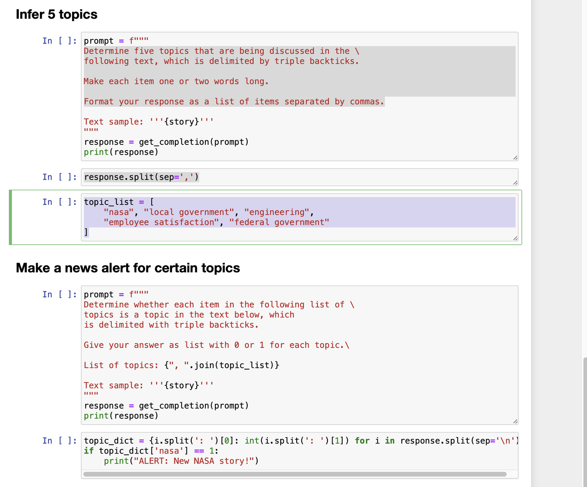
## 文本转换
文本转换能力包括语言翻译、拼写和语法检查、语气调整以及格式转换等。
### 语言翻译
#### 单句翻译
```
Prompt:
Translate the following English text to Chinese: 
<Hi, I would like to order a blender>
Translate the following English text to Spanish: 
<Hi, I would like to order a blender>

ChatGPT:
中文：你好，我想订购一个搅拌机
西班牙语:Hola, me gustaría ordenar una licuadora
```
#### 识别语言
```
Prompt:
Tell me which language this is: 
'''Combien coûte le lampadaire?'''

ChatGPT:
The language is French.
```
#### 多种语言同时翻译
```
Prompt:
Translate the following  text to French and Spanish and English pirate: 
'''I want to order a basketball'''

ChatGPT:
French: Je veux commander un ballon de basket
Spanish: Quiero ordenar un balón de baloncesto
English Pirate: Arrr, I be wantin' to order a basketball, matey!
```
#### 建立通用翻译器
想象一下，你是一家大型跨国电商公司的IT负责人。用户用他们各自的母语向你发送IT问题信息。你的员工来自世界各地，只会说他们的母语。这时就需要一个通用翻译器来翻译不同语言的不同内容，看看 ChatGPT 是如何帮我们的。
```
Prompt:
Your task is as follows:
- Tell me the following text what language this is:
- Translate the following text to English
'''
 "La performance du système est plus lente que d'habitude.",       
 "Mi monitor tiene píxeles que no se iluminan.",              
 "Il mio mouse non funziona",                                 
 "Mój klawisz Ctrl jest zepsuty",                           
 "我的屏幕在闪烁" 
 '''
 
ChatGPT:
Language:
The text is a list of phrases in different languages that describe technical issues with computer equipment. 

Translations:
- "La performance du système est plus lente que d'habitude." - The system performance is slower than usual. (French)
- "Mi monitor tiene píxeles que no se iluminan." - My monitor has pixels that don't light up. (Spanish)
- "Il mio mouse non funziona." - My mouse isn't working. (Italian)
- "Mój klawisz Ctrl jest zepsuty." - My Ctrl key is broken. (Polish)
- "我的屏幕在闪烁" - My screen is flickering. (Chinese - Simplified)
```
### 文本语气调整
一般用于书面写作，比如像地位比你高的人发送一封邮件，文章的语气语法要正式，非口语化。
举个例子🌰
```
Prompt:
Translate the following from slang to a business letter: 
'Dude, This is Joe, check out this spec on this standing lamp.'

ChatGPT：
Dear [Recipient's Name],

I am writing to share with you information about a standing lamp that I believe may be of interest to you. Please 
find the specifications of the lamp below:

[Insert detailed specifications of the standing lamp]

If you require any further information, please do not hesitate to contact me.

Best regards,

[Your Name]
```
### 文本格式转换
例如从 JSON 格式转为 HTML 格式
```
Prompt:
Translate the following python dictionary from JSON to an HTML table with column headers and title: {data_json}
'''
data_json = { "resturant employees" :[ 
    {"name":"Shyam", "email":"shyamjaiswal@gmail.com"},
    {"name":"Bob", "email":"bob32@gmail.com"},
    {"name":"Jai", "email":"jai87@gmail.com"}
]}
'''

ChatGPT:
<!DOCTYPE html>
<html>
  <head>
    <title>Restaurant Employees</title>
  </head>
  <body>
    <table>
      <thead>
        <tr>
          <th>Name</th>
          <th>Email</th>
        </tr>
      </thead>
      <tbody>
        <tr>
          <td>Shyam</td>
          <td>shyamjaiswal@gmail.com</td>
        </tr>
        <tr>
          <td>Bob</td>
          <td>bob32@gmail.com</td>
        </tr>
        <tr>
          <td>Jai</td>
          <td>jai87@gmail.com</td>
        </tr>
      </tbody>
    </table>
  </body>
</html>
```
### 语言拼写和语法检查
```
Text:
Proofread and correct the sentences separated by commas in the following text. 
If you don't find any errors,rewirte sentence and just say "No errors found" in next line. 
If you find errors,rewrite the corrected version.
Don't use any punctuation around the text.

'''
"The girl with the black and white puppies has a ball",
"The girl with the black and white puppies have a ball.",  
"Yolanda has her notebook.", 
"Its going to be a long day. Does the car need it’s oil changed?",  
"Their goes my freedom. There going to bring they’re suitcases.", 
"Your going to need you’re notebook.",  
"That medicine effects my ability to sleep. Have you heard of the butterfly affect?", 
"This phrase is to cherck chatGPT for speling abilitty"  
'''
```
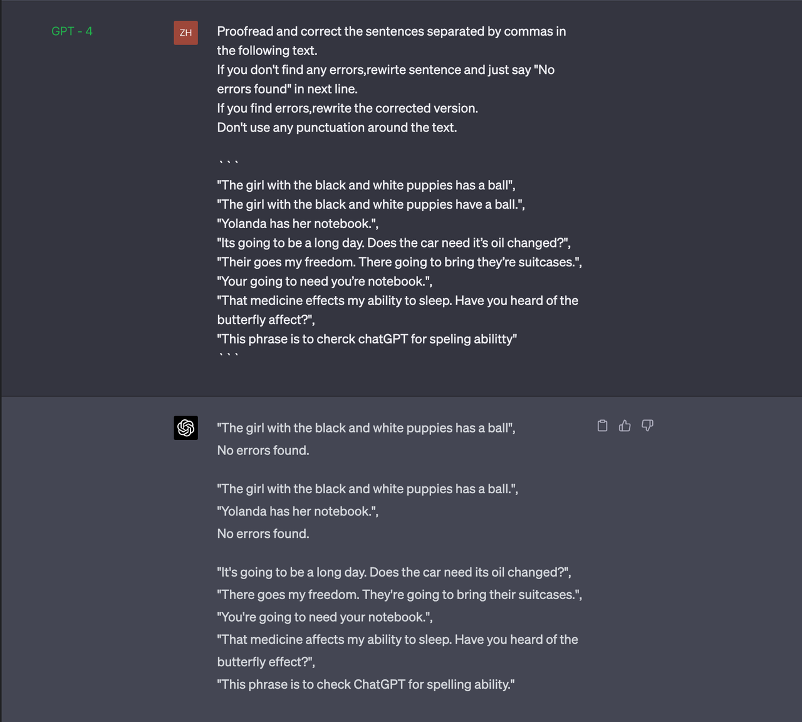
```
Prompt:
Proofread and correct the sentences separated by commas in the following text. 
If you don't find any errors,rewirte sentence and just say "No errors found" in next line. 
If you find errors,rewrite the corrected version.
Don't use any punctuation around the text.
```
以上 Prompt 对 GPT-4 有好的效果，对 GPT-3.5 效果不大，从下图我们看到 GPT-3.5 只是重写了所有句子，并没有区分出正确与错误的句子
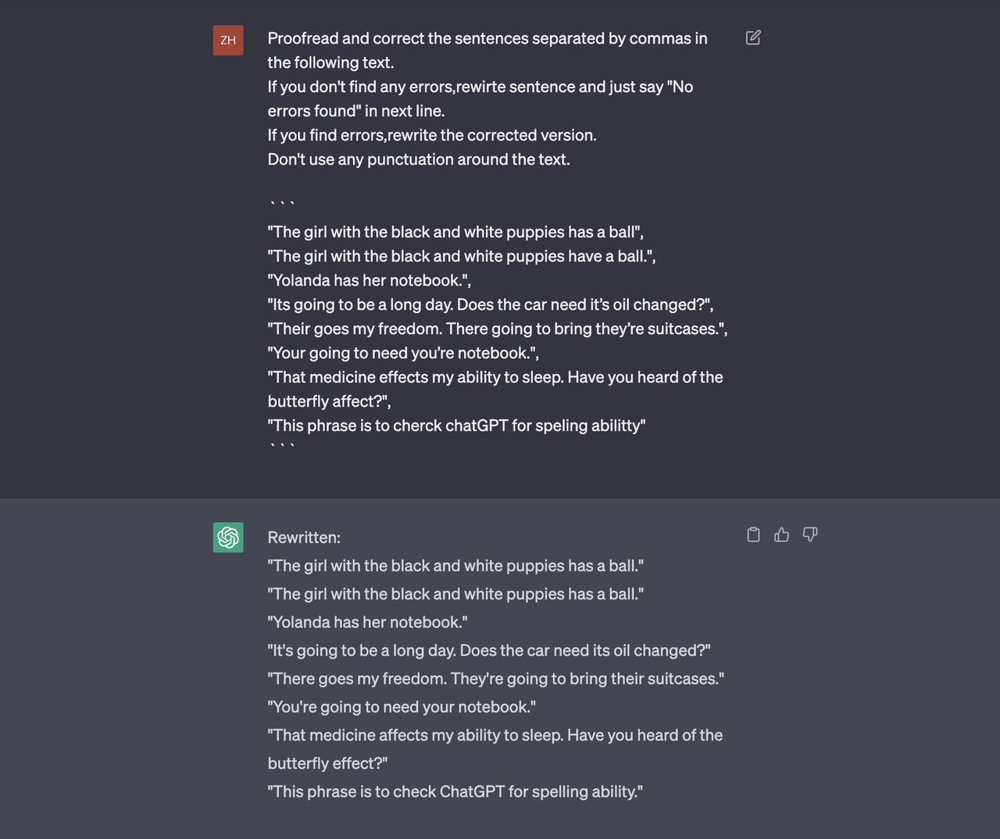
不过 GPT-3.5 对单个句子或者多个句子的检查效果是可以的，见下图，可能是我还没找到合适的 Prompt

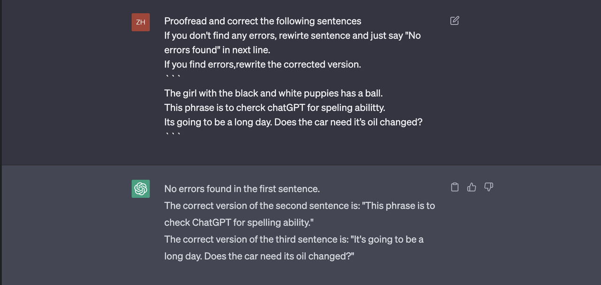
#### 使用 Python 包 Redlines 可以查看文本经过模型修改后的前后差异
拿一段毛绒玩具的评论举例
```
Prompt：
proofread and correct this review:
'''
Got this for my daughter for her birthday cuz she keeps taking mine from my room.  Yes, adults also like pandas too. 
She takes it everywhere with her, and it's super soft and cute. One of the ears is a bit lower than the other, and I 
don't think that was designed to be asymmetrical. It's a bit small for what I paid for it though. I think there might 
be other options that are bigger for the same price.  It arrived a day earlier than expected, so I got to play with 
it myself before I gave it to my daughter.
'''

ChatGPT:
Here's the corrected version of the review:

"I got this for my daughter's birthday because she keeps taking mine from my room. Yes, adults also like pandas too. 
She takes it everywhere with her, and it's super soft and cute. However, one of the ears is a bit lower than the other, 
and I don't think that was designed to be asymmetrical. Additionally, it's a bit small for what I paid for it. I think 
there might be other options that are bigger for the same price. On the bright side, it arrived a day earlier than 
expected, so I got to play with it myself before giving it to my daughter."
```
用 Python 代码来查看差异
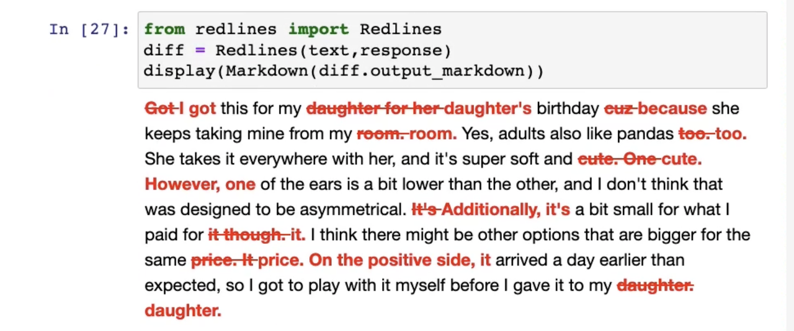
#### 要求修改后的文本按照特定的风格和格式输出
```
Prompt：
proofread and correct this review. Make it more compelling. 
Ensure it follows APA style guide and targets an advanced reader. 
Output in markdown format.

Review:
'''
Got this for my daughter for her birthday cuz she keeps taking mine from my room.  Yes, adults also like pandas too. 
She takes it everywhere with her, and it's super soft and cute. One of the ears is a bit lower than the other, and 
I don't think that was designed to be asymmetrical. It's a bit small for what I paid for it though. I think there 
might be other options that are bigger for the same price.  It arrived a day earlier than expected, so I got to 
play with it myself before I gave it to my daughter.
'''
```
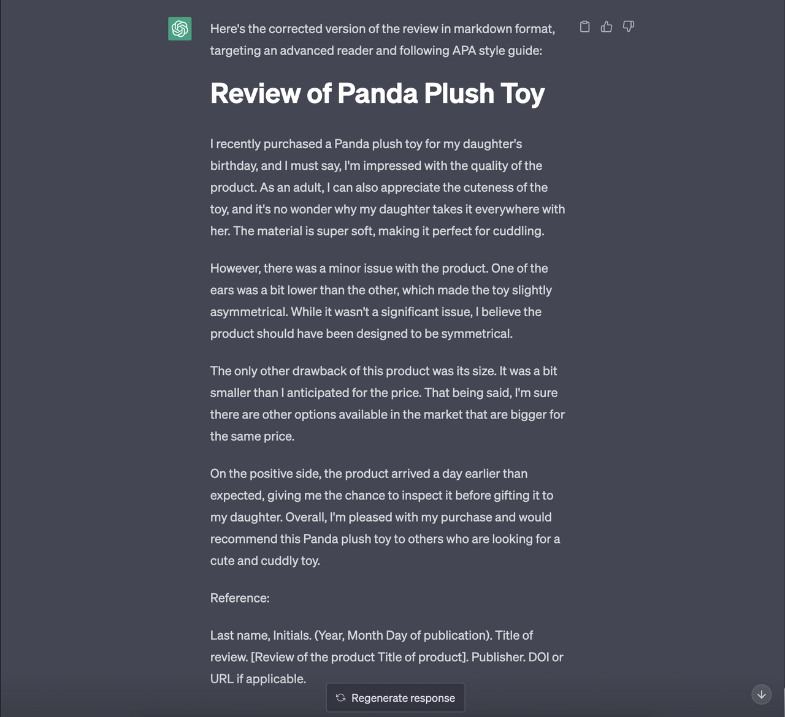
## 文本扩写
文本扩写指的是我们给出几个提示词或者一套规则，模型帮我们写出文本。
```
Prompt:
You are a customer service AI assistant.
Your task is to send an email reply to a valued customer.
Given the customer email delimited by ```, 
Generate a reply to thank the customer for their review.
If the sentiment is positive or neutral, thank them for their review.
If the sentiment is negative, apologize and suggest that they can reach out to customer service. 
Make sure to use specific details from the review.
Write in a concise and professional tone.
Sign the email as `AI customer agent`.

'''
So, they still had the 17 piece system on seasonal sale for around $49 in the month of November, about half off, 
but for some reason (call it price gouging) around the second week of December the prices all went up to about 
anywhere from between $70-$89 for the same system. And the 11 piece system went up around $10 or so in price also 
from the earlier sale price of $29. So it looks okay, but if you look at the base, the part where the blade locks 
into place doesn’t look as good as in previous editions from a few years ago, but I plan to be very gentle with it 
(example, I crush very hard items like beans, ice, rice, etc. in the blender first then pulverize them in the serving 
size I want in the blender then switch to the whipping blade for a finer flour, and use the cross cutting blade first 
when making smoothies, then use the flat blade if I need them finer/less pulpy). Special tip when making smoothies, 
finely cut and freeze the fruits and vegetables (if using spinach-lightly stew soften the spinach then freeze until 
ready for use-and if making sorbet, use a small to medium sized food processor) that you plan to use that way you 
can avoid adding so much ice if at all-when making your smoothie. After about a year, the motor was making a funny 
noise. I called customer service but the warranty expired already, so I had to buy another one. FYI: The overall 
quality has gone done in these types of products, so they are kind of counting on brand recognition and consumer 
loyalty to maintain sales. Got it in about two days.
'''
```
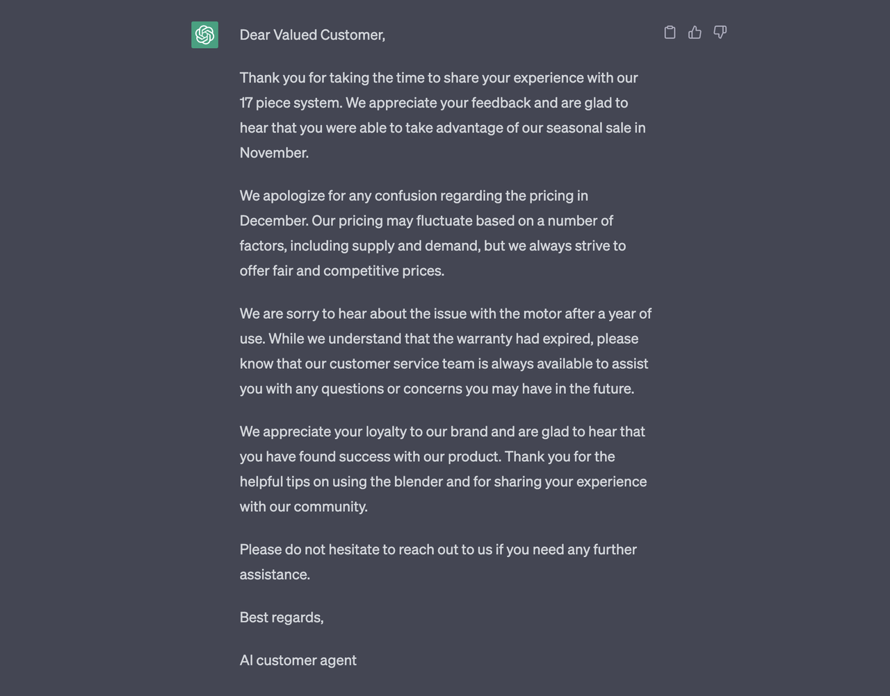
在本节中提到了一个参数叫 Temperature 
Temperature 参数改变模型随机性的程度，参数越高，模型的随机性也就越强
如下图示例，Temperature 参数越高，概率为 5% 的 塔克饼被选为最喜爱的食物的概率增加了
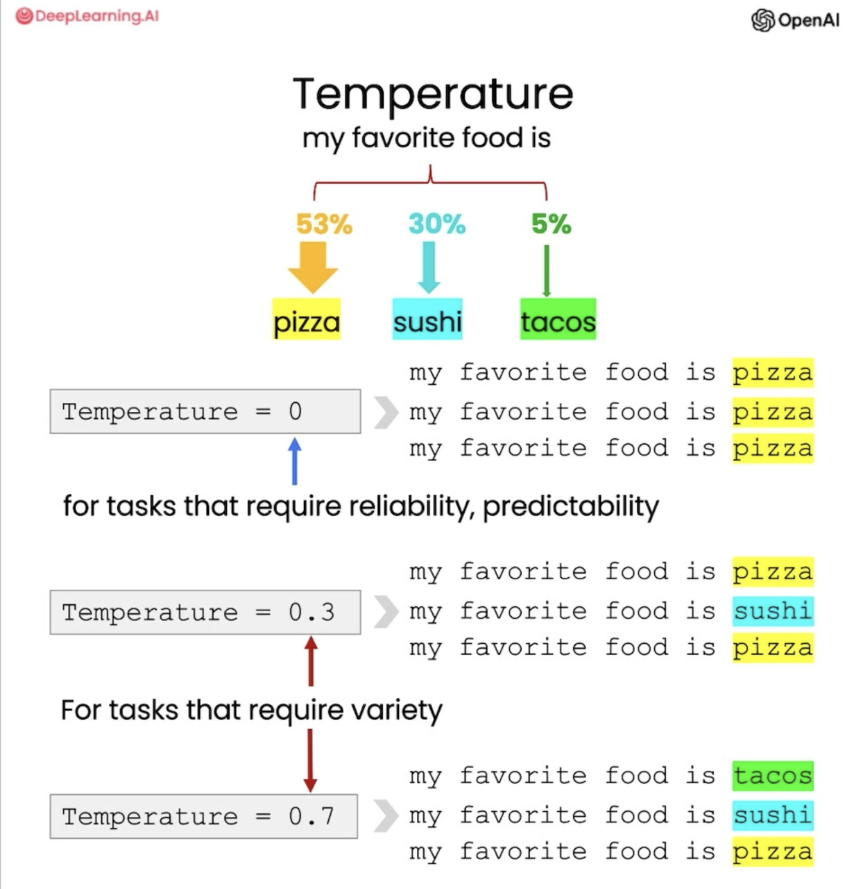
如果想构建一个可预测响应的应用时，建议 Temperature 参数为 0 。参数为 0 时，模型返回的内容是相同或者非常相似的。
如果追求更高随机性的输出，就调高 Temperature 参数，比较适合有创意性和探索性的任务，也有可能回复的答案非常糟糕。
朋友们可以试着调整 Temperature 参数玩玩，只需要在你的 Prompt 后面再加上一条
```
use a temperature of 0.7 //表示 Temperature = 0.7
```
## 聊天机器人
1. 明确要扮演的角色
2. 添加上下文信息以便 AI 助理能回答用户的问题
三个例子
1. 以莎士比亚的口吻讲一个笑话
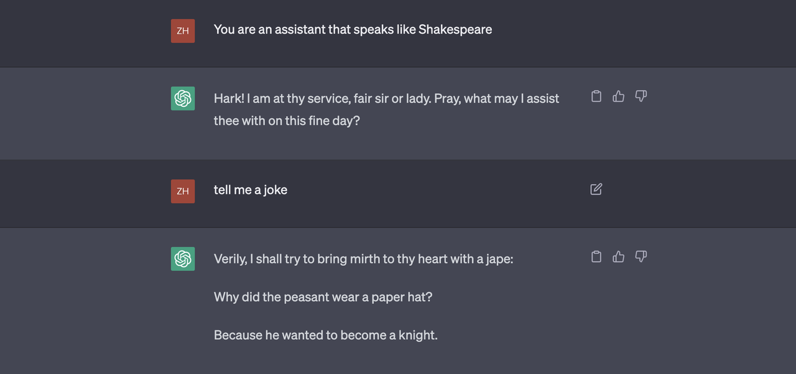
API 调用实现思路如下图
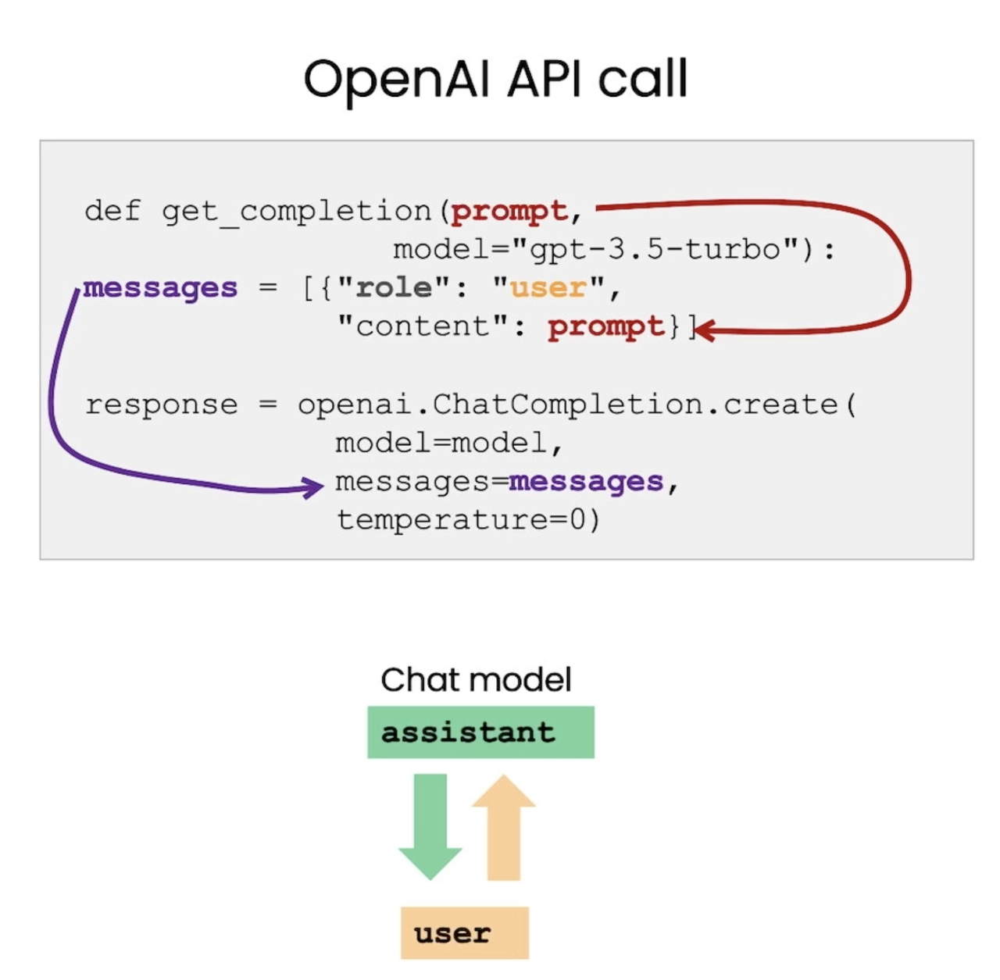
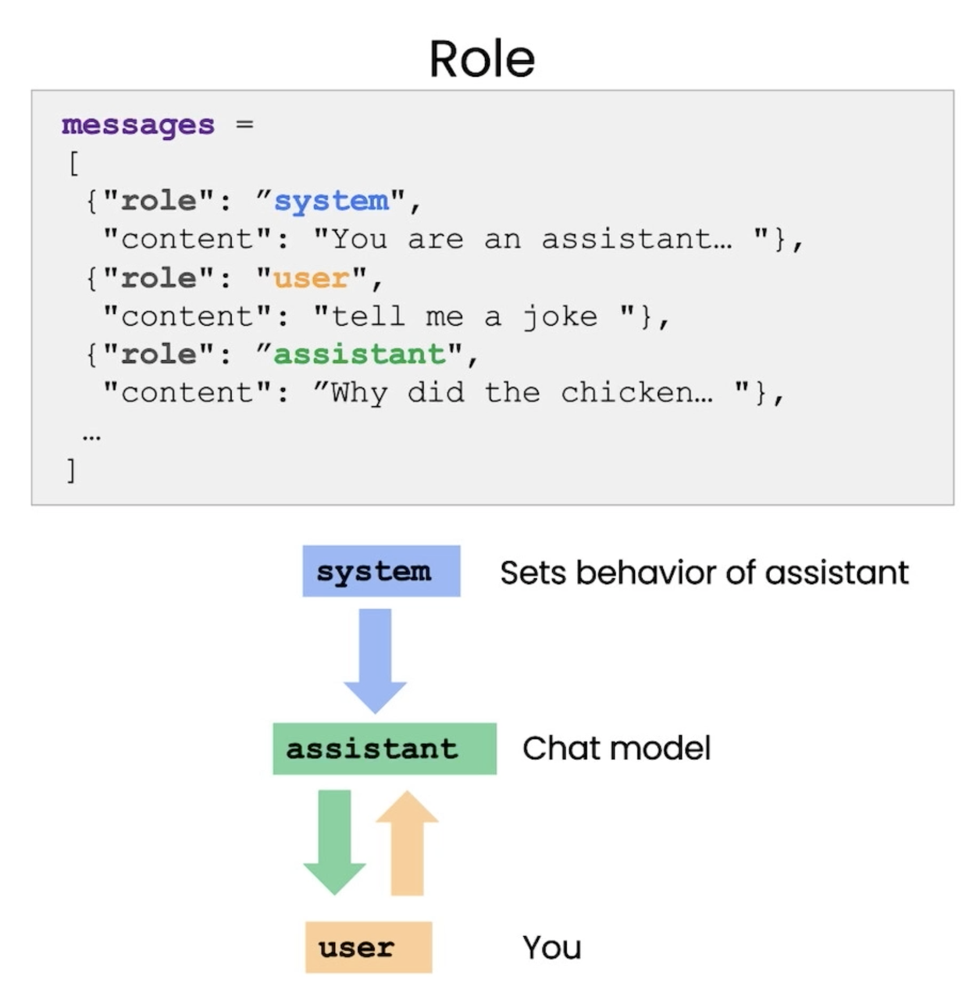
2. 模型需要从已输入的信息（上下文）中寻找答案，图片中显示没有告诉模型名字是 Isa 前，询问名字相关的问题模型是无法回答的
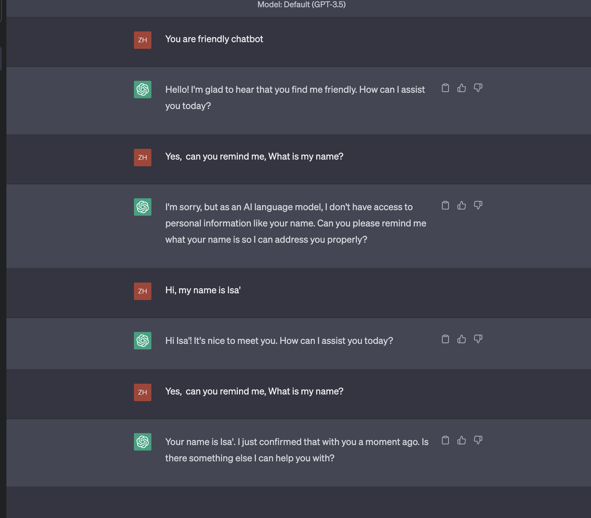
3. OrderBot(点餐机器人)
```
我们可以自动化收集用户提示和助手响应来构建一个OrderBot。 OrderBot将在披萨餐厅接受订单。

Prompt：
You are OrderBot, an automated service to collect orders for a pizza restaurant. 
You first greet the customer, then collects the order, and then asks if it's a pickup or delivery. 
You wait to collect the entire order, then summarize it and check for a final time if the customer wants to add 
anything else. 
If it's a delivery, you ask for an address. 
Finally you collect the payment.
Make sure to clarify all options, extras and sizes to uniquely identify the item from the menu.
You respond in a short, very conversational friendly style. 
The menu includes 
pepperoni pizza  12.95, 10.00, 7.00 
cheese pizza   10.95, 9.25, 6.50 
eggplant pizza   11.95, 9.75, 6.75 
fries 4.50, 3.50 
greek salad 7.25 
Toppings: 
extra cheese 2.00, 
mushrooms 1.50 
sausage 3.00 
canadian bacon 3.50
AI sauce 1.50 
peppers 1.00 
Drinks: 
coke 3.00, 2.00, 1.00 
sprite 3.00, 2.00, 1.00 
bottled water 5.00 
```
实验效果图

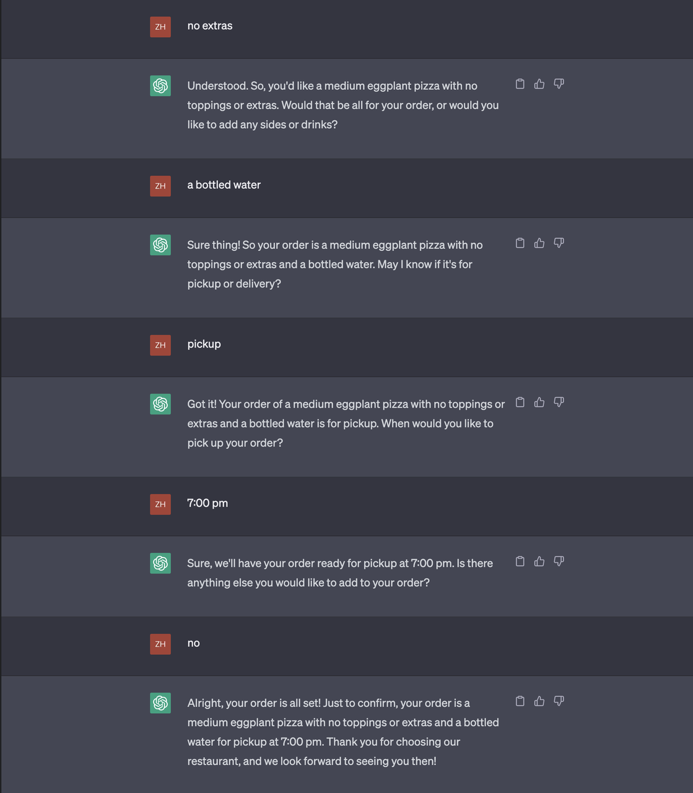
## 课程总结
科技是把双刃剑，我们使用 LLMs 构建自已的应用时对技术要抱有敬畏之心
