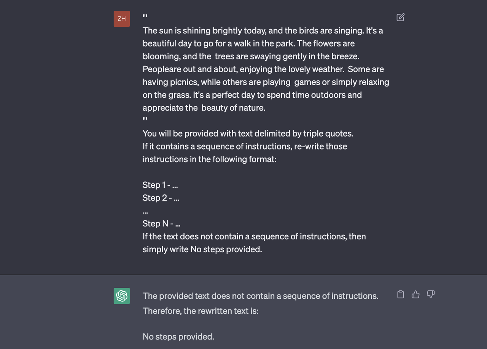

# ChatGPT-Prompt-Engineering-For-Developers

## 项目简介

看了 Andrew Ng(吴恩达) x Isa Fulford《ChatGPT Prompt Engineering for Developers》课程以后受益匪浅，做了图文教程版方便自己回顾。如果能够帮到你是最好不过了。因为是个人总结的，信息不如原视频详细，想体验一手资料的朋友可移步下列链接

英文原版视频：[ChatGPT Prompt Engineering For Developers](https://learn.deeplearning.ai/chatgpt-prompt-eng/lesson/1/introduction) 

中文字幕视频地址：[吴恩达 x OpenAI 的 Prompt Engineering 课程专业翻译版](https://www.bilibili.com/video/BV1Bo4y1A7FU/?share_source=copy_web) 

中英双语字幕下载：[《ChatGPT 提示工程》非官方版中英双语字幕](https://github.com/GitHubDaily/ChatGPT-Prompt-Engineering-for-Developers-in-Chinese)

也可以期待一波大佬们整理的课程

[ChatGPT Prompt Engineering For Developers 课程中文版 Datawahale](https://github.com/datawhalechina/prompt-engineering-for-developers)

## 内容大纲


## 课程简介
本节介绍了两种 大语言模型（Large Language models）并解释了它们的不同之处。
### 基础大语言模型（Base LLM）
Base LLM 被训练成基于文本训练数据来预测下一个单词，通过互联网和其它来源的大量文本数据计算出下一个最可能出现的词是什么。

```
比如你输入提示：
从前有只独角兽，它会进行补全，并预测接下来的几个词是
和所有独角兽朋友一起生活在一个神奇的森林里

如果你是用"法国的首都是什么"作为提示语，Base LLM 可能会输出以下内容。
什么是法国最大的城市？
什么是法国的人口？
因为互联网上的文章很可能是关于法国的测验问题列表。
```

### 指令学习大语言模型（Instruction Tuned LLM）
Instruction Tuned LLM 的训练方式是从一个在大量文本数据上训练过的 Base LLM 开始，然后进一步训练它，并通过输入和输出来微调其性能以遵循指示并尝试执行好这些指示。然后通常使用一种叫做人类反馈强化学习（Reinforcement Learning with Human Feedback）技术进一步优化系统，使其更能够帮助人们并遵循指示。
```
比如你输入提示：
法国首都是什么？
它很有可能输出法国的首都是巴黎
```
Instruction Tuned LLM 经过训练后与 Base LLM 相比在输出内容的安全方面有很大的提升，并且由于 OpenAI 和其他 LLMs 公司的工作，Instruction Tuned LLM 将会变得更加安全和一致。所以吴恩达老师建议大多人们关注学习 Instruction Tuned LLM.
### 简短举例说明如何使用 Instruction Tuned LLM 
当你使用 Instruction Tuned LLMs 时，可以比作向另一个聪明但不知道任务具体细节的人发出指令。所以 LLMs 无法工作时，有时是因为说明不够清晰。
例如，如果你想说“请写一些关于艾伦·图灵的东西”，除此之外，还可以明确是否希望文本集中讨论他的科学工作、个人生活或历史角色等方面。并且如果你指定了文本应该采取何种语气，则更有助于实现期望效果，它应该像专业记者写作那样正式吗，还是更像给朋友随手写下的小纸条？
当然，如果你想象自己在要求一位刚毕业的大学生为你完成这项任务，甚至可以指定他们事先需要阅读哪些文本片段来撰写关于艾伦·图灵的文章，这能帮助大学生更好地完成任务。
## 提示指南
### 原则一：写出清晰而具体的提示
#### 策略一：使用分界符来指出不同输入的不同部分，以下符号都是可以的，任选其一，自己喜欢就好
* 三个引号："""
* 三个反引号： ```
* 三个波折号：---
* 尖括号： <>
* XML 标签：<tag></tag>
```
Text：
You should express what you want a model to do by providing instructions that are as clear and specific as you can possibly make 
them. This will guide the model towards the desired output,  and reduce the chances of receiving irrelevant or incorrect responses. 
Don't confuse writing a clear prompt with writing a short prompt. In many cases, longer prompts provide more clarity and context 
for the model, which can lead to more detailed and relevant outputs.

Prompt：
Summarize the text delimited by triple backticks into a single sentence.
```{text}```
```
使用分隔符可以避免提示词的注入，如果总结的内容是指令的话，那么分隔符可以很好地区分开来，例如

图片中使用了 ''' 分隔符，模型就知道要总结内容，而不是遵循内容中的指令
#### 策略二：要求格式化输出，格式类似HTML，JSON
```
Prompt:
Generate a list of three made-up book titles along with their authors and genres. 
Provide them in JSON format with the following keys: book_id, title, author, genre.
```

#### 策略三： 要求模型检查条件是否得到满足，如果任务中的条件并不一定满足，我们可以告诉模型先检查条件，条件如不满足，则指出条件不满足的地方并停止执行任务。也可以实现考虑好任务的边界条件，告诉模型如何处理。
例如 从一段泡茶步骤中提取指令（有指令步骤的例子）
```
Text:
Making a cup of tea is easy! First, you need to get some water boiling. While that's happening, grab a cup and put a tea bag in 
it. Once the water is hot enough, just pour it over the tea bag.  Let it sit for a bit so the tea can steep. After a few minutes, 
take out the tea bag. If you like, you can add some sugar or milk to taste.  And that's it! You've got yourself a delicious cup 
of tea to enjoy.

Prompt：
You will be provided with text delimited by triple quotes. 
If it contains a sequence of instructions, re-write those instructions in the following format:
Step 1 - ...
Step 2 - …
…
Step N - …
If the text does not contain a sequence of instructions, then simply write No steps provided.
```

无指令步骤的例子，下面一段描写场景的文本。
```
Text:
The sun is shining brightly today, and the birds are singing. It's a beautiful day to go for a walk in the park. The flowers are 
blooming, and the  trees are swaying gently in the breeze. Peopleare out and about, enjoying the lovely weather.  Some are having 
picnics, while others are playing  games or simply relaxing on the grass. It's a perfect day to spend time outdoors and appreciate 
the  beauty of nature.

Prompt:
You will be provided with text delimited by triple quotes. 
If it contains a sequence of instructions, re-write those instructions in the following format:

Step 1 - ...
Step 2 - …
…
Step N - …
If the text does not contain a sequence of instructions, then simply write No steps provided.
```

#### 策略四："Few-shot" prompting，我把它理解为样本学习，我们给出模板，模型参照学习
```
Prompt:
Your task is to answer in a consistent style.
<child>: Teach me about patience.
<grandparent>: The river that carves the deepest valley flows from a modest spring; the 
grandest symphony originates from a single note; the most intricate tapestry begins with a solitary thread.

<child>: Teach me about resilience.
```

通过以上四个策略，可以确保我们距离「写出清晰而具体的提示」这一原则不会偏差的太远。
### 原则二：给模型思考的时间
要保持这一原则的原因视频中有解释，主要有两点，我的理解如下:</br>
第一点是如果指定的任务太复杂，模型无法在短时间内或用少量的词语完成它，它可能会编造一个猜测答案，这个猜测答案可能是错误的。</br>
基于第一点，第二点是模型在推理时出现了错误，用时少但是得出了错误的结论。我们应该重新设计提示语，要求模型有一系列的推理，然后再提供最终的答案。</br>
「而我们重新设计提示语，要求模型有自己的推理」的过程，就是原则二「给模型思考的时间」</br>
这一章也介绍两个策略来告诉我们如何保持这一原则。
#### 策略一：指定完成任务的步骤
```
Prompts:
Perform the following actions: 
1 - Summarize the following text delimited by triple backticks with 1 sentence.
2 - Translate the summary into French.
3 - List each name in the French summary.
4 - Output a json object that contains the following 
keys: french_summary, num_names.
Separate your answers with line breaks.

Text:
'''
In a charming village, siblings Jack and Jill set out on a quest to fetch water from a hilltop well. As they climbed, singing 
joyfully, misfortune struck—Jack tripped on a stone and tumbled down the hill, with Jill following suit. Though slightly battered, 
the pair returned home to comforting embraces. Despite the mishap, their adventurous spirits remained undimmed, and they continued 
exploring with delight.
'''
```

要求输出特殊格式
```
Your task is to perform the following actions: 
1 - Summarize the following text delimited by triple backticks with 1 sentence.
2 - Translate the summary into French.
3 - List each name in the French summary.
4 - Output a json object that contains the following keys: french_summary, num_names.

Use the following format:
Text: <text to summarize>
Summary: <summary>
Translation: <summary translation>
Names: <list of names in Italian summary>
Output JSON: <json with summary and num_names>

Text: 
'''
In a charming village, siblings Jack and Jill set out on a quest to fetch water from a hilltop well. As they climbed, singing 
joyfully, misfortune struck—Jack tripped on a stone and tumbled down the hill, with Jill following suit. Though slightly
battered, the pair returned home to comforting embraces. Despite the mishap, their adventurous spirits remained undimmed, 
and they continued exploring with delight.
'''
```

#### 策略二：在急于得出结论之前，引导模型自行解决问题（我知道你很急，但你先别急）
下面是一个「判断学生方案是否正确」的例子
```
Prompt:
Determine if the student's solution is correct or not.

Question:
I'm building a solar power installation and I need help working out the financials. 
- Land costs $100 square foot
- I can buy solar panels for $250 square foot
- I negotiated a contract for maintenance that will cost me a flat $100k per year, and an additional $10 square foot
What is the total cost for the first year of operations as a function of the number of square feet.

Student's Solution:
Let x be the size of the installation in square feet.
Costs:
1. Land cost: 100x
2. Solar panel cost: 250x
3. Maintenance cost: 100,000 + 100x
Total cost: 100x + 250x + 100,000 + 100x = 450x + 100,000
```

请注意其实学生的做法是错误的，而 ChatGPT 却认为学生的做法是对的,我们可以通过指导模型首先得出它自己的解决方案来修复此缺陷。
```
Prompt:
Your task is to determine if the student's solution is correct or not.
To solve the problem do the following:
- First, work out your own solution to the problem. 
- Then compare your solution to the student's solution and evaluate if the student's solution is correct or not. 
Don't decide if the student's solution is correct until you have done the problem yourself.

Use the following format:
Question:
‘’‘
question here
‘’‘
Student's solution:
‘’‘
student's solution here
‘’‘
Actual solution:
‘’‘
steps to work out the solution and your solution here
‘’‘
Is the student's solution the same as actual solution just calculated:
‘’‘
yes or no
‘’‘
Student grade:
‘’‘
correct or incorrect
‘’‘

Question:
‘’‘
I'm building a solar power installation and I need help working out the financials. 
- Land costs $100 square foot
- I can buy solar panels for $250 square foot
- I negotiated a contract for maintenance that will cost me a flat $100k per year, and an additional $10 square foot
What is the total cost for the first year of operations as a function of the number of square feet.

Student's Solution:
Let x be the size of the installation in square feet.
Costs:
1. Land cost: 100x
2. Solar panel cost: 250x
3. Maintenance cost: 100,000 + 100x
Total cost: 100x + 250x + 100,000 + 100x = 450x + 100,000
‘’‘
```
下图是我用 GPT-4 得出的答案，用 GPT-3.5 暂时无法得出答案，有哪位朋友用 GPT-3.5 得出正确答案了。请不吝赐教你的 Prompt

### 模型的局限性
视频中还介绍了一个模型的局限性。我理解为模型会虚构事物，虚构的非常真实，但其实不是真的。那如何减少模型虚构的可能性呢？做法是如果是基于文本生成答案，则要求模型在文中找到任何相关的引用，使用引用来回答问题。
视频课程中列举了一个智能牙刷的例子来证明 GPT 模型的虚构能力，在现实生活不存在这款智能牙刷的。
以下是 GPT-3.5 和 GPT-4 的回答


## 迭代开发你的提示词
吴恩达老师讲没有任何一个提示词可以完美地适应每个场景，不必太多关注网上“xx个提示词更好地帮助你”类似这样的文章，获得合适的提示词的过程才是重要的。
### 提示词迭代过程

- 提示词清晰简洁
- 分析为什么没有得到期望的输出
- 完善想法和提示，或者给模型更多的时间思考
- 重复以上过程
### 椅子说明书的例子
```
Prompt:
Your task is to help a marketing team create a description for a retail website of a product based on a technical fact sheet.

Write a product description based on the information provided in the technical specifications delimited by triple backticks.

Technical specifications:
'''
OVERVIEW
- Part of a beautiful family of mid-century inspired office furniture, 
including filing cabinets, desks, bookcases, meeting tables, and more.
- Several options of shell color and base finishes.
- Available with plastic back and front upholstery (SWC-100) 
or full upholstery (SWC-110) in 10 fabric and 6 leather options.
- Base finish options are: stainless steel, matte black, 
gloss white, or chrome.
- Chair is available with or without armrests.
- Suitable for home or business settings.
- Qualified for contract use.

CONSTRUCTION
- 5-wheel plastic coated aluminum base.
- Pneumatic chair adjust for easy raise/lower action.

DIMENSIONS
- WIDTH 53 CM | 20.87”
- DEPTH 51 CM | 20.08”
- HEIGHT 80 CM | 31.50”
- SEAT HEIGHT 44 CM | 17.32”
- SEAT DEPTH 41 CM | 16.14”

OPTIONS
- Soft or hard-floor caster options.
- Two choices of seat foam densities: 
 medium (1.8 lb/ft3) or high (2.8 lb/ft3)
- Armless or 8 position PU armrests 

MATERIALS
SHELL BASE GLIDER
- Cast Aluminum with modified nylon PA6/PA66 coating.
- Shell thickness: 10 mm.
SEAT
- HD36 foam

COUNTRY OF ORIGIN
- Italy
```

#### 迭代一：生成的文本太长，可以限制单词/句子/字符的数量
```
Your task is to help a marketing team create a description for a retail website of a product based on a technical fact sheet.

Write a product description based on the information provided in the technical specifications delimited by triple backticks.

Use at most 50 words.
Use at most 3 sentences
Use at most 280 characters

Technical specifications:
'''
chair description
'''
```

#### 迭代二：当生成的文本关注了错误的细节时，提示词说明应该侧重于哪些方面
下面是一个「面向家具零售商，侧重于椅子的技术和材料性质的产品描述」
```
Prompt:
Your task is to help a marketing team create a description for a retail website of a product based on a technical fact sheet.

Write a product description based on the information provided in the technical specifications delimited by triple backticks.

The description is intended for furniture retailers, so should be technical in nature and focus on the materials the product is 
constructed from.
At the end of the description, include every 7-character Product ID in the technical specification.

Use at most 50 words.

Technical specifications:
'''
chair description
'''
```

#### 迭代三：需要尺寸以表格形式描述
```
Prompt:
Your task is to help a marketing team create a description for a retail website of a product based on a technical fact sheet.

Write a product description based on the information provided in the technical specifications delimited by triple backticks.

The description is intended for furniture retailers, so should be technical in nature and focus on the materials the product is 
constructed from.
At the end of the description, include every 7-character Product ID in the technical specification.

Use at most 50 words.

After the description, include a table that gives the product's dimensions. The table should have two columns.
In the first column include the name of the dimension. In the second column include the measurements in inches only.

Give the table the title 'Product Dimensions'.

Format everything as HTML that can be used in a website. 
Place the description in a <div> element.

Technical specifications:
'''
chair description
'''
```
```HTML
ChatGPT:
<div>
  Discover this mid-century inspired office chair, crafted from cast aluminum with a modified nylon PA6/PA66 coating. 
  Featuring a 5-wheel base, pneumatic adjust, and HD36 foam seat, choose from plastic (SWC-100) or fully 
  upholstered (SWC-110) options. Armrests optional. Ideal for contract use.
</div>

<table>
  <caption>Product Dimensions</caption>
  <tr>
    <th>Dimension</th>
    <th>Measurement (in)</th>
  </tr>
  <tr>
    <td>Width</td>
    <td>20.87</td>
  </tr>
  <tr>
    <td>Depth</td>
    <td>20.08</td>
  </tr>
  <tr>
    <td>Height</td>
    <td>31.50</td>
  </tr>
  <tr>
    <td>Seat Height</td>
    <td>17.32</td>
  </tr>
  <tr>
    <td>Seat Depth</td>
    <td>16.14</td>
  </tr>
</table>

```
## 文本总结
这节课程主要向我们展现了 ChatGPT 的文本总结能力，我们以下列商品评论为文本来看看 ChatGPT 可以怎样去总结文本。
```
Text：
Got this panda plush toy for my daughter's birthday, who loves it and takes it everywhere. It's soft and super cute, and its 
face has a friendly look. It's a bit small for what I paid though. I think there might be other options that are bigger for 
the same price. It arrived a day earlier than expected, so I got to play with it myself before I gave it to her.
```
### 在单词数/句子数/字符数限制的条件下总结
```
Prompt:
Your task is to generate a short summary of a product review from an ecommerce site. 
Summarize the review below, delimited by triple backticks, in at most 30 words/in at most three words/in at most 280 characters. 

Review:
'''
revies description
'''

ChatGPT:
Soft and super cute panda plush toy loved by daughter and arrived a day earlier. However, a bit small for the price.
```
### 对不同的主题进行总结
#### 主题为运输和交付时
```
Prompt：
Your task is to generate a short summary of a product review from an ecommerce site to give feedback to the Shipping deparmtment. 

Summarize the review below, delimited by triple backticks, in at most 30 words, and focusing on any aspects that mention shipping 
and delivery of the product. 

Review:
'''
revies description
'''

ChatGPT:
The product arrived a day earlier than expected, allowing for personal testing, but the customer feels it's overpriced for 
the small size. No specific feedback for the shipping department.
```
#### 主题为价格和价值时
```
Prompt:
Your task is to generate a short summary of a product review from an ecommerce site to give feedback to the pricing deparmtment, 
responsible for determining the price of the product.  

Summarize the review below, delimited by triple backticks, in at most 30 words, and focusing on any aspects that are relevant 
to the price and perceived value. 

Review:
'''
revies description
'''

ChatGPT:
The plush toy is soft, cute, and loved by the recipient, but a bit small for the price paid. The reviewer suggests there may 
be better options at the same price point.
```
#### 尝试用「提取」来替代「总结」
「总结」会包含与焦点话题无关的话题，「提取」只输出焦点话题的内容。
```
Prompt:
Your task is to extract relevant information from a product review from an ecommerce site to give feedback to the Shipping 
department. 
From the review below, delimited by triple quotes extract the information relevant to shipping and delivery. Limit to 30 words. 

Review:
'''
revies description
'''

ChatGPT:
Arrived a day earlier than expected.
```
### 总结多个产品评论
```
Text1:
Needed a nice lamp for my bedroom, and this one had additional storage and not too high of a price point. Got it fast - arrived 
in 2 days. The string to the lamp broke during the transit and the company happily sent over a new one. Came within a few days 
as well. It was easy to put together. Then I had a missing part, so I contacted their support and they very quickly got me the 
missing piece! Seems to me to be a great company that cares about their customers and products. 
```
```
Text2:
My dental hygienist recommended an electric toothbrush, which is why I got this. The battery life seems to be pretty impressive 
so far. After initial charging and leaving the charger plugged in for the first week to condition the battery, I've unplugged 
the charger and been using it for twice daily brushing for the last 3 weeks all on the same charge. But the toothbrush head 
is too small. I’ve seen baby toothbrushes bigger than this one. I wish the head was bigger with different length bristles to 
get between teeth better because this one doesn’t.  Overall if you can get this one around the $50 mark, it's a good deal. 
The manufactuer's replacements heads are pretty expensive, but you can get generic ones that're more reasonably priced. 
This toothbrush makes me feel like I've been to the dentist every day. My teeth feel sparkly clean! 
```
```
Text3:
So, they still had the 17 piece system on seasonal sale for around $49 in the month of November, about half off, but for 
some reason (call it price gouging) around the second week of December the prices all went up to about anywhere from between 
$70-$89 for the same system. And the 11 piece system went up around $10 or so in price also from the earlier sale price of $29. 
So it looks okay, but if you look at the base, the part where the blade locks into place doesn’t look as good as in previous
editions from a few years ago, but I plan to be very gentle with it (example, I crush very hard items like beans, ice, rice, etc. 
in the blender first then pulverize them in the serving size I want in the blender then switch to the whipping blade for a finer 
flour, and use the cross cutting blade first when making smoothies, then use the flat blade if I need them finer/less pulpy). 
Special tip when making smoothies, finely cut and freeze the fruits and vegetables (if using spinach-lightly stew soften the 
spinach then freeze until ready for use-and if making sorbet, use a small to medium sized food processor) that you plan to use 
that way you can avoid adding so much ice if at all-when making your smoothie.After about a year, the motor was making a funny 
noise.I called customer service but the warranty expired already, so I had to buy another one. FYI: The overall quality has gone 
done in these types of products, so they are kind of counting on brand recognition and consumer loyalty to maintain sales. 
Got it in about two days.
```
```
Prompt:
因为视频中用了 Python 中的循环处理，所以下面 Prompt 是我自己写的
Your task is to generate a short summary of a product review from an ecommerce site. 
Summarize the reviews below, there are three paragraphs in total，they are delimited by triple backticks in at most 20 words.

use follow format:
Review1 Summary:<summary1>
Review2 Summary:<summary2>
Review3 Summary:<summary3>

Review:
'''
revies description
'''

ChatGPT:
Review1 Summary: Fast delivery, lamp arrived with broken string, but company provided a new one and missing part quickly.
Review2 Summary: Electric toothbrush has impressive battery life, but toothbrush head is too small. Good deal if bought around $50.
Review3 Summary: Blender quality has gone down, but still works well. Tips provided for making smoothies. Price increase from seasonal sale. 
```
## 模型推断
模型将输入的文本做某种分析，可以说提取主题标签，提取名字，情感分析等任务。
下面是「一盏灯」的评论，对这段文本我们进行多种类型的推断。
```
Text:
Needed a nice lamp for my bedroom, and this one had additional storage and not too high of a price point.Got it fast.The string 
to our lamp broke during the transit and the company happily sent over a new one.Came within a few days as well. It was easy 
to put together.I had a missing part, so I contacted their support and they very quickly got me the missing piece! Lumina seems 
to me to be a great company that cares about their customers and products!
```
### 情感判断
