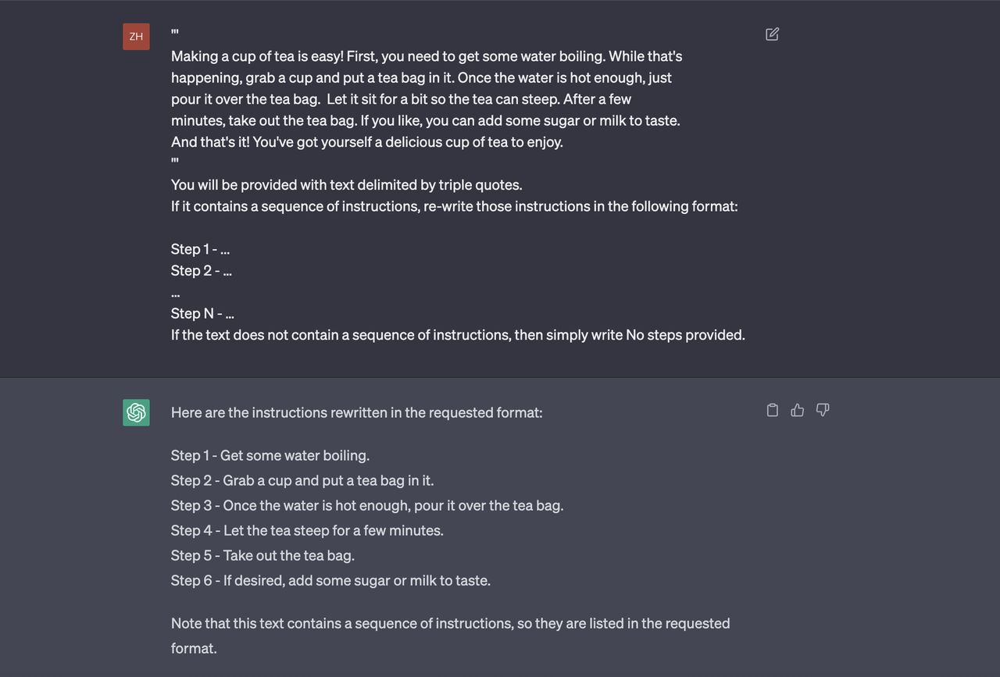
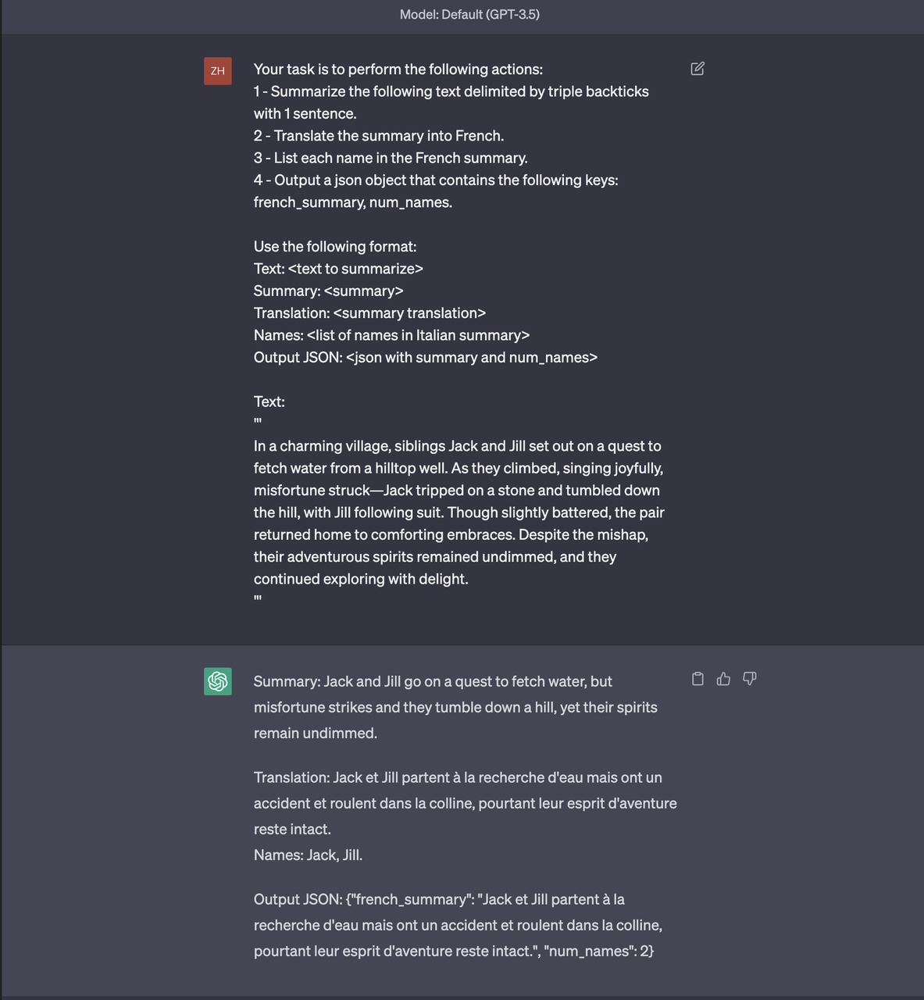

# ChatGPT-Prompt-Engineering-For-Developers

## 项目简介

看了 Andrew Ng(吴恩达) x Isa Fulford《ChatGPT Prompt Engineering for Developers》课程以后受益匪浅，做了图文教程版方便自己回顾。如果能够帮到你是最好不过了。因为是个人总结的，信息不如原视频详细，想体验一手资料的朋友可移步下列链接

英文原版视频：[ChatGPT Prompt Engineering For Developers](https://learn.deeplearning.ai/chatgpt-prompt-eng/lesson/1/introduction) 

中文字幕视频地址：[吴恩达 x OpenAI 的 Prompt Engineering 课程专业翻译版](https://www.bilibili.com/video/BV1Bo4y1A7FU/?share_source=copy_web) 

中英双语字幕下载：[《ChatGPT 提示工程》非官方版中英双语字幕](https://github.com/GitHubDaily/ChatGPT-Prompt-Engineering-for-Developers-in-Chinese)

也可以期待一波大佬们整理的课程

[ChatGPT Prompt Engineering For Developers 课程中文版 Datawahale](https://github.com/datawhalechina/prompt-engineering-for-developers)

## 内容大纲


## 课程简介
本节介绍了两种 大语言模型（Large Language models）并解释了它们的不同之处。
### 基础大语言模型（Base LLM）
Base LLM 被训练成基于文本训练数据来预测下一个单词，通过互联网和其它来源的大量文本数据计算出下一个最可能出现的词是什么。

```
比如你输入提示：
从前有只独角兽，它会进行补全，并预测接下来的几个词是
和所有独角兽朋友一起生活在一个神奇的森林里

如果你是用"法国的首都是什么"作为提示语，Base LLM 可能会输出以下内容。
什么是法国最大的城市？
什么是法国的人口？
因为互联网上的文章很可能是关于法国的测验问题列表。
```

### 指令学习大语言模型（Instruction Tuned LLM）
Instruction Tuned LLM 的训练方式是从一个在大量文本数据上训练过的 Base LLM 开始，然后进一步训练它，并通过输入和输出来微调其性能以遵循指示并尝试执行好这些指示。然后通常使用一种叫做人类反馈强化学习（Reinforcement Learning with Human Feedback）技术进一步优化系统，使其更能够帮助人们并遵循指示。
```
比如你输入提示：
法国首都是什么？
它很有可能输出法国的首都是巴黎
```
Instruction Tuned LLM 经过训练后与 Base LLM 相比在输出内容的安全方面有很大的提升，并且由于 OpenAI 和其他 LLMs 公司的工作，Instruction Tuned LLM 将会变得更加安全和一致。所以吴恩达老师建议大多人们关注学习 Instruction Tuned LLM.
### 简短举例说明如何使用 Instruction Tuned LLM 
当你使用 Instruction Tuned LLMs 时，可以比作向另一个聪明但不知道任务具体细节的人发出指令。所以 LLMs 无法工作时，有时是因为说明不够清晰。
例如，如果你想说“请写一些关于艾伦·图灵的东西”，除此之外，还可以明确是否希望文本集中讨论他的科学工作、个人生活或历史角色等方面。并且如果你指定了文本应该采取何种语气，则更有助于实现期望效果，它应该像专业记者写作那样正式吗，还是更像给朋友随手写下的小纸条？
当然，如果你想象自己在要求一位刚毕业的大学生为你完成这项任务，甚至可以指定他们事先需要阅读哪些文本片段来撰写关于艾伦·图灵的文章，这能帮助大学生更好地完成任务。
## 提示指南
### 原则一：写出清晰而具体的提示
#### 策略一：使用分界符来指出不同输入的不同部分，以下符号都是可以的，任选其一，自己喜欢就好
* 三个引号："""
* 三个反引号： ```
* 三个波折号：---
* 尖括号： <>
* XML 标签：<tag></tag>
```
Text：
You should express what you want a model to do by providing instructions that are as 
clear and specific as you can possibly make them. This will guide the model towards 
the desired output,  and reduce the chances of receiving irrelevant or incorrect 
responses. Don't confuse writing a clear prompt with writing a short prompt. In many 
cases, longer prompts provide more clarity and context for the model, which can lead to 
more detailed and relevant outputs.

Prompt：
Summarize the text delimited by triple backticks into a single sentence.
```{text}```
```
使用分隔符可以避免提示词的注入，如果总结的内容是指令的话，那么分隔符可以很好地区分开来，例如

图片中使用了 ''' 分隔符，模型就知道要总结内容，而不是遵循内容中的指令
#### 策略二：要求格式化输出，格式类似HTML，JSON
```
Prompt:
Generate a list of three made-up book titles along with their authors and genres. 
Provide them in JSON format with the following keys: book_id, title, author, genre.
```

#### 策略三： 要求模型检查条件是否得到满足，如果任务中的条件并不一定满足，我们可以告诉模型先检查条件，条件如不满足，则指出条件不满足的地方并停止执行任务。也可以实现考虑好任务的边界条件，告诉模型如何处理。
例如 从一段泡茶步骤中提取指令（有指令步骤的例子）
```
Text:
Making a cup of tea is easy! First, you need to get some water boiling. While that's happening, grab 
a cup and put a tea bag in it. Once the water is hot enough, just pour it over the tea bag.  Let it 
sit for a bit so the tea can steep. After a few minutes, take out the tea bag. If you like, you can 
add some sugar or milk to taste.  And that's it! You've got yourself a delicious cup of tea to enjoy.

Prompt：
You will be provided with text delimited by triple quotes. 
If it contains a sequence of instructions, re-write those instructions in the following format:

Step 1 - ...
Step 2 - …
…
Step N - …
If the text does not contain a sequence of instructions, then simply write No steps provided.
```

无指令步骤的例子，下面一段描写场景的文本。
```
Text:
The sun is shining brightly today, and the birds are singing. It's a beautiful day to go for a walk in the park. 
The flowers are blooming, and the  trees are swaying gently in the breeze. Peopleare out and about, enjoying the 
lovely weather.  Some are having picnics, while others are playing  games or simply relaxing on the grass. It's 
a perfect day to spend time outdoors and appreciate the  beauty of nature.

Prompt:
You will be provided with text delimited by triple quotes. 
If it contains a sequence of instructions, re-write those instructions in the following format:

Step 1 - ...
Step 2 - …
…
Step N - …
If the text does not contain a sequence of instructions, then simply write No steps provided.
```

#### 策略四："Few-shot" prompting，我把它理解为样本学习，我们给出模板，模型参照学习
```
Prompt:
Your task is to answer in a consistent style.
<child>: Teach me about patience.
<grandparent>: The river that carves the deepest valley flows from a modest spring; the 
grandest symphony originates from a single note; the most intricate tapestry begins with a solitary thread.

<child>: Teach me about resilience.
```

通过以上四个策略，可以确保我们距离「写出清晰而具体的提示」这一原则不会偏差的太远。
### 原则二：给模型思考的时间
要保持这一原则的原因视频中有解释，主要有两点，我的理解如下:</br>
第一点是如果指定的任务太复杂，模型无法在短时间内或用少量的词语完成它，它可能会编造一个猜测答案，这个猜测答案可能是错误的。</br>
基于第一点，第二点是模型在推理时出现了错误，用时少但是得出了错误的结论。我们应该重新设计提示语，要求模型有一系列的推理，然后再提供最终的答案。</br>
「而我们重新设计提示语，要求模型有自己的推理」的过程，就是原则二「给模型思考的时间」</br>
这一章也介绍两个策略来告诉我们如何保持这一原则。
#### 策略一：指定完成任务的步骤
```
Prompts:
Perform the following actions: 
1 - Summarize the following text delimited by triple backticks with 1 sentence.
2 - Translate the summary into French.
3 - List each name in the French summary.
4 - Output a json object that contains the following 
keys: french_summary, num_names.
Separate your answers with line breaks.

Text:
'''
In a charming village, siblings Jack and Jill set out on a quest to fetch water from a hilltop well. As they climbed, singing joyfully, misfortune struck—Jack tripped on a stone and tumbled down the hill, with Jill following suit. Though slightly battered, the pair returned home to comforting embraces. Despite the mishap, their adventurous spirits remained undimmed, and they continued exploring with delight.
'''
```

要求输出特殊格式
```
Your task is to perform the following actions: 
1 - Summarize the following text delimited by triple backticks with 1 sentence.
2 - Translate the summary into French.
3 - List each name in the French summary.
4 - Output a json object that contains the following keys: french_summary, num_names.

Use the following format:
Text: <text to summarize>
Summary: <summary>
Translation: <summary translation>
Names: <list of names in Italian summary>
Output JSON: <json with summary and num_names>

Text: 
'''
In a charming village, siblings Jack and Jill set out on a quest to fetch water from a hilltop well. As they climbed, singing joyfully, misfortune struck—Jack tripped on a stone and tumbled down the hill, with Jill following suit. Though slightly battered, the pair returned home to comforting embraces. Despite the mishap, their adventurous spirits remained undimmed, and they continued exploring with delight.
'''
```

#### 策略二：在急于得出结论之前，引导模型自行解决问题（我知道你很急，但你先别急）
下面是一个「判断学生方案是否正确」的例子
```
Prompt:
Determine if the student's solution is correct or not.

Question:
I'm building a solar power installation and I need help working out the financials. 
- Land costs $100 square foot
- I can buy solar panels for $250 square foot
- I negotiated a contract for maintenance that will cost me a flat $100k per year, and an additional $10 square foot
What is the total cost for the first year of operations as a function of the number of square feet.

Student's Solution:
Let x be the size of the installation in square feet.
Costs:
1. Land cost: 100x
2. Solar panel cost: 250x
3. Maintenance cost: 100,000 + 100x
Total cost: 100x + 250x + 100,000 + 100x = 450x + 100,000
```

请注意其实学生的做法是错误的，而 ChatGPT 却认为学生的做法是对的,我们可以通过指导模型首先得出它自己的解决方案来修复此缺陷。
```
Prompt:
Your task is to determine if the student's solution is correct or not.
To solve the problem do the following:
- First, work out your own solution to the problem. 
- Then compare your solution to the student's solution and evaluate if the student's solution is correct or not. 
Don't decide if the student's solution is correct until you have done the problem yourself.

Use the following format:
Question:
‘’‘
question here
‘’‘
Student's solution:
‘’‘
student's solution here
‘’‘
Actual solution:
‘’‘
steps to work out the solution and your solution here
‘’‘
Is the student's solution the same as actual solution just calculated:
‘’‘
yes or no
‘’‘
Student grade:
‘’‘
correct or incorrect
‘’‘

Question:
‘’‘
I'm building a solar power installation and I need help working out the financials. 
- Land costs $100 square foot
- I can buy solar panels for $250 square foot
- I negotiated a contract for maintenance that will cost me a flat $100k per year, and an additional $10 square foot
What is the total cost for the first year of operations as a function of the number of square feet.

Student's Solution:
Let x be the size of the installation in square feet.
Costs:
1. Land cost: 100x
2. Solar panel cost: 250x
3. Maintenance cost: 100,000 + 100x
Total cost: 100x + 250x + 100,000 + 100x = 450x + 100,000
‘’‘
```
下图是我用 GPT-4 得出的答案，用 GPT-3.5 暂时无法得出答案，有哪位朋友用 GPT-3.5 得出正确答案了。请不吝赐教你的 Prompt

### 模型的局限性
视频中还介绍了一个模型的局限性。我理解为模型会虚构事物，虚构的非常真实，但其实不是真的。那如何减少模型虚构的可能性呢？做法是如果是基于文本生成答案，则要求模型在文中找到任何相关的引用，使用引用来回答问题。
视频课程中列举了一个智能牙刷的例子来证明 GPT 模型的虚构能力，在现实生活不存在这款智能牙刷的。
以下是 GPT-3.5 和 GPT-4 的回答


## 迭代开发你的提示词
吴恩达老师没有任何一个提示词可以完美地适应每个场景，不必太多关注网上“xx个提示词更好地帮助你”类似这样的文章，获得合适的提示词的过程才是重要的。
### 提示词迭代过程


